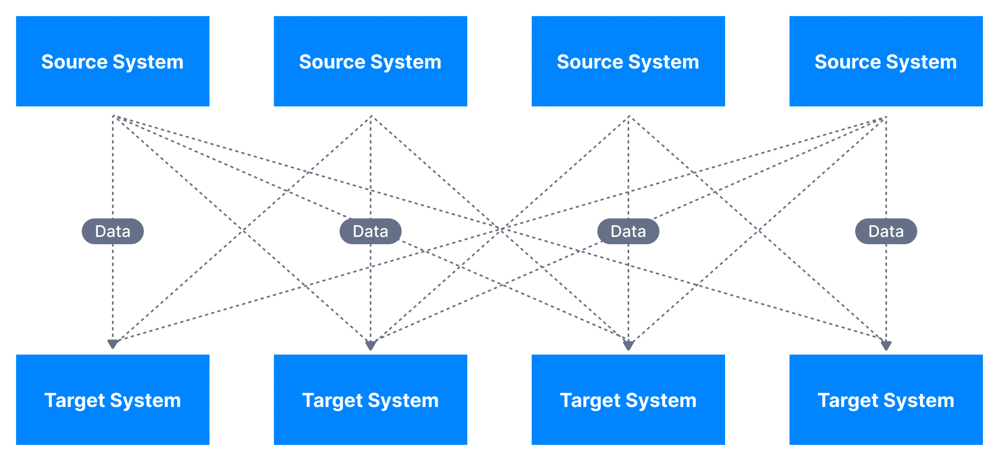
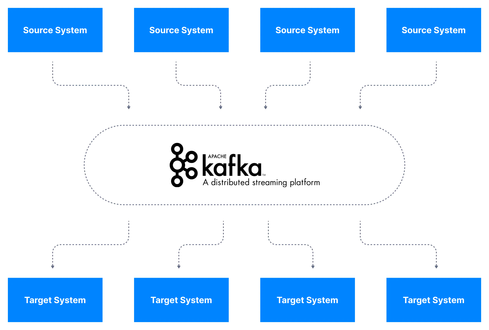
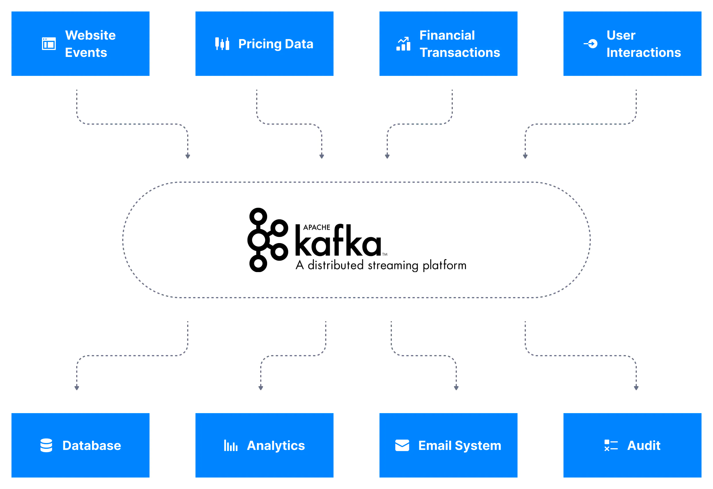

아파치 카프카(이하 카프카)는 **분산 스트리밍 플랫폼**으로, **실시간 데이터 파이프라인**을 만들 때 주로 사용되는 오픈소스 솔루션이다.

이번 문서에서는 카프카라는 솔루션이 **왜 등장**했고, **어떤 역할**을 하게 됐는지, 그리고 **어디에서 사용**되는지 살펴보려 한다.

> 본 문서는 시리즈로 이어지는 문서이다.   카프카의 구성이나 작동 방식에 대해서는 아래 시리즈 목차를 참고하자.
> #### 시리즈 목차
> * [Apache Kafka 소개 - Part 1](https://bky373.github.io/2022-07-01-introduction-to-apache-kafka-part-1/) - 현재 문서
> * [Apache Kafka 소개 - Part 2](https://bky373.github.io/2022-07-02-introduction-to-apache-kafka-part-2/)
> * [Kafka Topic 소개](https://bky373.github.io/2022-07-03-kafka-topics/)
> * [Kafka Producer & Message](https://bky373.github.io/2022-07-04-kafka-producers-and-messages/)
> * [Kafka Consumer 소개](https://bky373.github.io/2022-07-05-kafka-consumers/)
> * [Kafka Consumer Group & Offset](https://bky373.github.io/2022-07-06-kafka-consumer-group-and-offsets/)
> * [Kafka Broker 소개](https://bky373.github.io/2022-07-07-kafka-brokers/)

# 1. 카프카의 등장

## 1.1. LinkedIn 에서의 시작

카프카는 2011년 LinkedIn에서 **실시간 데이터 피드**를 처리하기 위해 만들어졌다. (기존 메시지 큐(대기열) 시스템으로는 할 수 없는 내부
스트림 처리를 수행하기 위해 만들어졌다).

이후 메시지 대기열에서 초당 백만 개 이상의 메시지 또는 하루에 수조 개의 메시지를 처리할 수 있는 **이벤트 스트리밍 플랫폼**으로 빠르게 발전하였다.

## 1.2. 대규모 데이터 통합 플랫폼

빠르게 진화한 카프카는 **대규모 데이터를 통합**하는 **플랫폼**으로도 이용되기 시작한다.

기업에서는 비즈니스를 하는 동안 주문, 고객관리 등 여러 애플리케이션에서 **다양한 데이터**를 수집한다.
이러한 데이터는 애플리케이션의 프로세스에 따라 **다양한 형식으로 입력되고 수정**된다.
높은 수준의 비즈니스를 하려면 이러한 데이터를 **통합**해서 사용해야 하지만 서로 다른 형식의 데이터를 동시에 사용하는 일은 쉽지 않다.

특히 소스 시스템과 타겟 시스템 사이의 직선적인 데이터 교류는 시스템에 종속적일 수밖에 없고 아래 제약 사항에서 자유롭지 못하다.

* 초기 데이터 스키마 및 추후 변경될 스키마
* 데이터 형식 – 데이터가 구문 분석되는 방식(Binary, CSV, JSON, Avro…)
* 프로토콜 – 데이터가 전송되는 방식(TCP, HTTP, REST, FTP, JDBC…)

> [이미지 출처](https://www.conduktor.io/kafka/what-is-apache-kafka-part-1)

반면, 카프카는 위의 문제를 깔끔히 해결한다. 미리 요약하면, **카프카는 데이터 스트림과 시스템을 철저히 분리**시켜준다.

아래와 같이 카프카를 **데이터 통합 계층**에 사용하면 **소스 시스템은 데이터를 카프카에 게시**하기만 하면 된다. 그리고 **타겟 시스템은 카프카로부터 데이터를 제공받기**만 하면 된다.
카프카는 소스 데이터 스트림과 타켓 시스템을 철저히 분리(decoupling)하기 때문에 시스템 종속적이지 않은 데이터 통합 솔루션이 될 수 있다.

> [이미지 출처](https://www.conduktor.io/kafka/what-is-apache-kafka-part-1)

# 2. 카프카에서 데이터 스트림이란?

데이터 스트림은 일반적으로 **데이터 시퀀스**를 의미한다. 카프카는 데이터 시퀀스에 데이터가 생성되는 즉시 접근을 시도하기 때문에 **데이터 스트리밍 플랫폼**이라 불린다.
카프카는 토픽(주제)별로 데이터 스트림을 저장하고 기업의 시스템은 이를 이용하여 **스트림 처리**를 수행한다.

다음 두 가지는 실제 기업에서 사용하는 데이터 스트림의 대표적인 예시다.

## 2.1. 로그 분석

요즘 시스템은 수백, 수천 개의 마이크로서비스를 가지고 있으며, 이들은 지속적으로 로그를 생성한다. 로그는 비즈니스 분석, 실패 예측 그리고 디버깅을 위해 수집된다.
문제는 이러한 대용량 로그 데이터를 어떻게 처리하느냐인데 기업에서는 **로그 데이터를 데이터 스트림으로 푸시하여 요구사항에 따라 스트림 처리**한다.

## 2.2. 웹 분석

**웹 분석**을 할 때도 데이터 스트림을 사용한다. 최신 웹 애플리케이션은 사이트 내의 거의 모든 사용자 활동(예: 버튼 클릭, 페이지 보기)을 측정한다.
기업은 보다 나은 비즈니스를 위해 이러한 데이터를 빠르게 합산하고 **사용자 활동** 분석 결과를 도출한다. 결국 실시간으로 생성된 데이터에 수분 내로 빠르게 **접근**하기 위해 데이터
스트림을 사용한다.

# 3. 카프카를 사용해야 하는 이유

위에서 얘기했듯이 요즘 기업은 **실시간 데이터 스트리밍 처리**를 통해 빠르게 비즈니스를 수행하고 목표를 달성한다. 이를 위해 높은 수준의 **스트리밍 플랫폼**이 요구되는 것은 당연하다.

카프카는 높은 수준의 스트리밍 플랫폼이다. **확장성이 뛰어나고** 대부분의 메시징 시스템과 비교하여 **처리량이 더 우수**하다.
또한 데이터를 유실없이 안전하게 전달해야 하는 메세지 시스템에서 fault-tolerant 한 **(시스템 일부가 고장나도 정상적으로 작동하는) 안정적인 아키텍처**를 제공한다.

이러한 특징 때문에 LinkedIn 외에도 Netflix, Apple, Uber 등 Fortune 100대 기업의 80% 이상이 카프카를 사용하고 있다.

# 4. 카프카 사용 사례

카프카는 아래와 같이 여러 곳에서 다양한 목적 아래 사용되고 있다.  

* **메시징 시스템** (Messaging systems)
* **활동 추적** (Activity Tracking)
* IoT 장치와 같은 다양한 위치에서 **메트릭 수집** (Gather metrics from IoT devices)
* **애플리케이션 로그 분석** (Application logs analysis)
* **시스템 종속성의 분리** (De-coupling of system dependencies)
* **빅 데이터 기술**과의 **통합** (Integration with Big Data technologies like Spark, Flink, Storm, Hadoop)
* **이벤트 소싱 스토어** (Event-sourcing store)

자세한 설명은 [이곳](https://kafka.apache.org/uses)을 참고하자.

# 5. 카프카 사용이 적합하지 않은 사례

아래는 카프카 사용이 적합하지 않은 사례다.

* **작업 대기열(Work queues)**: 카프카는 대기열이 아닌 **토픽**으로 구성된다. (이는 RabbitMQ, ActiveMQ, SQS와 다른 점이다).
  대기열을 사용할 경우 컨슈머를 무수히 확장할 수 있다. 하지만 카프카를 사용하면 컨슈머는 토픽의 파티션 수 이상으로 확장할 수 없다.
  또한 대기열을 사용하면 처리된 데이터가 삭제되지만 카프카의 데이터는 이미 처리되었다 하더라도 삭제되지 않는다.

다른 사례를 보려면 [이곳](https://www.conduktor.io/kafka/what-is-apache-kafka-part-1)을 참고하자.

# 6. 실제 기업의 사용 사례

### Uber

Uber는 실시간 가격 책정 파이프라인에서 카프카를 광범위하게 사용한다.
특히 카프카의 빠른 처리 속도와 유연성을 이용하여 현실 세계에서 끊임없이 변경되는 이벤트(사용 가능한 드라이버 수 및 위치, 사용자 및 위치, 날씨 이벤트, 기타 이벤트)에 맞게 가격
책정 모델을 조정하고 사용자에게 적절한 금액을 청구한다.

# 7. 참고 자료

* [conduktor, kafkademy - What is Apache Kafka?](https://www.conduktor.io/kafka/what-is-apache-kafka)
* [confluent - What is Kafka?](https://www.confluent.io/what-is-apache-kafka/?utm_medium=sem&utm_source=google&utm_campaign=ch.sem_br.nonbrand_tp.prs_tgt.kafka_mt.mbm_rgn.apac_lng.kor_dv.all_con.kafka-general&utm_term=%EC%95%84%ED%8C%8C%EC%B9%98%20%EC%B9%B4%ED%94%84%EC%B9%B4&creative=&device=c&placement=&gclid=Cj0KCQjw1vSZBhDuARIsAKZlijSa-NIfaLuM0Y0ysxpWB2RrMrTxymYHOBrcuS1b7TtVo7v6WEc7YVMaAh5YEALw_wcB)
* [아파치 카프카(Apache Kafka) 아키텍처 및 동작 방식](https://engkimbs.tistory.com/691)
