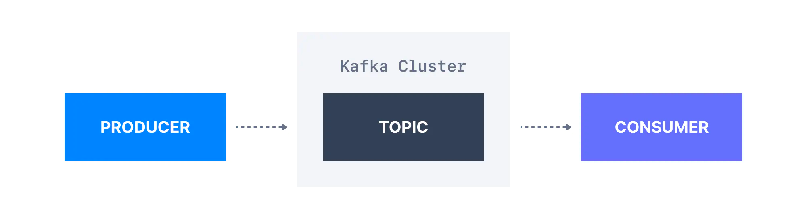
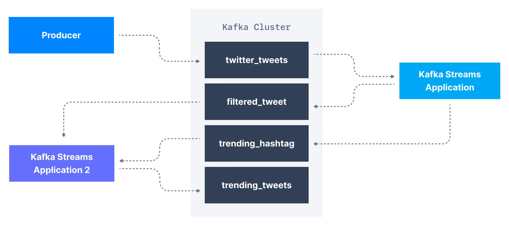
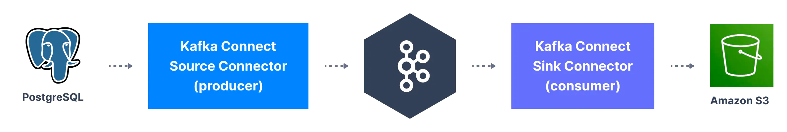

[카프카 소개 Part 1](https://bky373.github.io/2022-07-02-introduction-to-apache-kafka-part-1/) 에 이어 이번
문서에서는
카프카 **토픽(Topic)**, **프로듀서(Producer)** 그리고 **컨슈머(Consumer)**의 기본적인 사항에 대해 알아본다.
(각 내용의 구체적인 설명은 아래 시리즈 목차를 참고하자).

> 시리즈의 이전 문서를 먼저 읽고 오시면 좋습니다.  
> * [Apache Kafka 소개 - Part 1](https://bky373.github.io/2022-07-01-introduction-to-apache-kafka-part-1/)
> * [Apache Kafka 소개 - Part 2](https://bky373.github.io/2022-07-02-introduction-to-apache-kafka-part-2/) - 현재 문서
> * [Kafka Topic 소개](https://bky373.github.io/2022-07-03-kafka-topics/)
> * [Kafka Producer & Message](https://bky373.github.io/2022-07-04-kafka-producers-and-messages/)
> * [Kafka Consumer 소개](https://bky373.github.io/2022-07-05-kafka-consumers/)
> * [Kafka Consumer Group & Offset](https://bky373.github.io/2022-07-06-kafka-consumer-group-and-offsets/)
> * [Kafka Broker 소개](https://bky373.github.io/2022-07-07-kafka-brokers/)

# 1. 카프카 토픽 (Topic)

카프카 토픽은 서로 **관련된 이벤트**로 구성된 데이터 집단(group)이다. 예를 들어, **로그(logs)**라는 토픽이 있을 때 이 토픽은 애플리케이션의 로그 이벤트
데이터로 구성되어
있다. 토픽은 SQL 테이블과 유사하지만 SQL 테이블과 달리 쿼리할 수 없다. **토픽에 있는 데이터를 이용**하려면 **프로듀서**와 **생산자**를 만들고 이들을 토픽에
연동해야
한다. 토픽 데이터는 이진 형식(binary format)의 **key-value** 형식으로 저장된다.

# 2. 카프카 프로듀서 (Producer)

카프카에 토픽이 생성되면 다음 단계는 토픽으로 데이터를 보내는 것이다. 카프카 프로듀서는 이 **토픽으로 데이터를 보내는 일**을 담당한다.
일반적으로 Java, Python, Go와 같은 언어로 만들어진 **카프카 클라이언트 라이브러리**를 애플리케이션에 통합하고 애플리케이션에 구현된 프로듀서를
사용하여 카프카에 이벤트를 전송한다. 애플리케이션에 속하는 프로듀서는 당연히 **Kafka 외부**에서 배포된다.

# 3. 카프카 컨슈머 (Consumer)

하나 이상의 **토픽에서 이벤트 데이터를 가져오는** 애플리케이션을 카프카 컨슈머라고 한다.
카프카에서 이벤트를 사용하는 방법은 여러 가지가 있지만 일반적으로, 프로듀서와 같이, Java, Python, Go와 같은 언어로 된 **카프카 클라이언트 라이브러리**를
애플리케이션에 통합하고 애플리케이션에 구현된 컨슈머를 통해 이벤트를 사용한다. 기본적으로 컨슈머는 자신이 **토픽에 처음 연결된 이후 생성된 데이터만 사용**한다.
애플리케이션에 속하는 컨슈머 역시 **Kafka 외부**에서 배포된다.

# 4. 카프카 스트림즈 (Streams)

외부 시스템에서 생성한 데이터를 카프카로 보낸 후에 **스트림 처리 애플리케이션**(Stream processing applications)을 사용하여 데이터를 처리할 수 있다.
스트림 처리 애플리케이션은 Apache Kafka와 같은 스트리밍 데이터 저장소를 사용하여 실시간으로 데이터를 분석할 수 있다.

예를 들어 twitter_tweets라는 이름의 카프카 토픽이 있고 이 토픽에는 Twitter 상의 모든 tweet을 담은 데이터 스트리밍이 있다고 하자.
이 토픽에서는 아래 내용들을 수행할 수 있다.

* 10개 이상의 좋아요 또는 답글이 있는 트윗만 필터링하여 중요한 트윗 캡처
* 1분마다 각 해시태그 별로 수신된 트윗의 수 계산
* 두 가지를 결합하여 실시간으로 유행하는 트렌드 토픽과 해시태그 얻기

프로듀서와 컨슈머 코드를 변경해서 위의 내용을 수행할 수 있다. 하지만 이는 복잡하다.
대신 **카프카 토픽 변환** 기능을 지원하는 스트리밍 라이브러리를 사용할 수 있다.

이 경우라면 스트림 처리 프레임워크인 **카프카 스트림즈(Kafka Streams) 라이브러리**를 활용할 수 있다.
또는 카프카 스트림즈를 대신해서 Apache Spark 나 Apache Flink를 사용할 수 있다.

# 5. 카프카 커넥트 (Connect)

카프카로 데이터를 보내고 사용하기 위해 프로듀서와 컨슈머가 필요하다는 것을 알았다.
하지만 시간이 지남에 따라 많은 회사가 동일한 데이터 소스 유형(데이터베이스, 시스템 등...)을 공유한다는 것을 알게 되었고,
이 때문에 오픈 소스의 표준화된 코드를 작성하는 것이 더 유리하다는 사실을 알게 되었다.

**카프카 커넥트(Kafka Connect)**는 **널리 사용되는 시스템을 Kafka와 통합**할 수 있는 도구다.
이를 통해 기존 구성요소를 재사용하여 **카프카로 데이터를 소싱**할 수 있고, **카프카에서 다른 데이터 저장소로 데이터를 싱크**할 수 있다.

카프카 커넥트에는 크게 **두 가지 커넥터**가 존재한다.

* **소스 커넥터(Source Connector)**: 소스 시스템의 데이터를 **카프카 토픽으로 발행**(Publish)하는 커넥터다. (프로듀서 역할을 한다).
* **싱크 커넥터(Sink Connector)**: **카프카 토픽의 데이터를 구독**(Subscribe)해서 타겟 시스템에 반영하는 커넥터다. (컨슈머 역할을 한다).

대표적으로 많이 사용하는 커넥터는 아래와 같다.

* **소스 커넥터**
  * 데이터베이스(Debezium 커넥터 사용), JDBC, Couchbase, GoldenGate, SAP HANA, Blockchain, Cassandra,
    DynamoDB, FTP, IOT, MongoDB, MQTT, RethinkDB, Salesforce, Solr, SQS, Twitter 등 …
* **싱크 커넥터**
  * S3, ElasticSearch, HDFS, JDBC, SAP HANA, DocumentDB, Cassandra, DynamoDB, HBase,
    MongoDB, Redis, Solr, Splunk, Twitter

# 6. 참고 자료

* [conduktor, kafkademy - What is Apache Kafka?](https://www.conduktor.io/kafka/what-is-apache-kafka-part-2)
