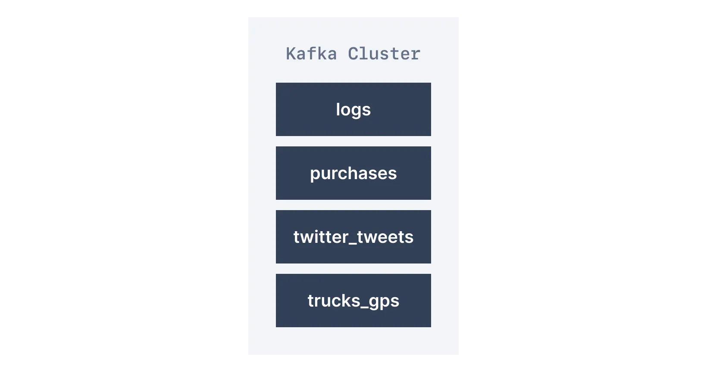
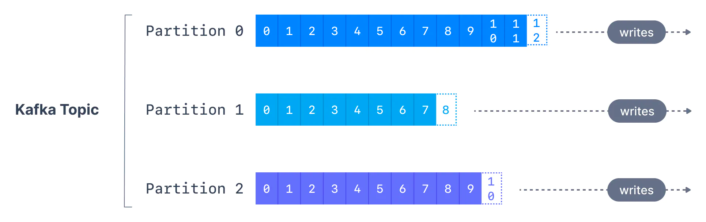
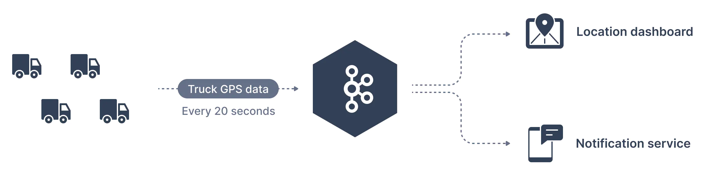

> 시리즈의 이전 문서를 먼저 읽고 오시면 좋습니다.  
> * [Apache Kafka 소개 - Part 1](https://bky373.github.io/2022-07-01-introduction-to-apache-kafka-part-1/)
> * [Apache Kafka 소개 - Part 2](https://bky373.github.io/2022-07-02-introduction-to-apache-kafka-part-2/)
> * [Kafka Topic 소개](https://bky373.github.io/2022-07-03-kafka-topics/) - 현재 문서
> * [Kafka Producer & Message](https://bky373.github.io/2022-07-04-kafka-producers-and-messages/)
> * [Kafka Consumer 소개](https://bky373.github.io/2022-07-05-kafka-consumers/)
> * [Kafka Consumer Group & Offset](https://bky373.github.io/2022-07-06-kafka-consumer-group-and-offsets/)
> * [Kafka Broker 소개](https://bky373.github.io/2022-07-07-kafka-brokers/)

# 1. 카프카 토픽이란? (Topic)

데이터베이스에서 **테이블**을 사용해서 데이터셋을 구성하고 분할하는 것처럼  
카프카는 **토픽**(Topic) 개념을 사용하여 관련 메시지를 구성하고 분할한다.

토픽은 데이터베이스의 테이블처럼 **쿼리할 수 없다**. 대신 토픽에 데이터를 보낼 프로듀서와 토픽에서 데이터를 순서대로 읽을 컨슈머를 만들어 연동한 후 데이터를 활용한다.

토픽은 **이름으로 식별**한다. 예를 들어 애플리케이션의 로그 메시지를 가지는 **logs** 라는 토픽과
애플리케이션의 구매 데이터를 가지는 **purchases** 라는 토픽은 이름이 다르기 때문에 서로 다른 토픽이다.

토픽은 **모든 형식, 모든 종류의 메시지**를 가질 수 있다. 그리고 모든 메시지 시퀀스를 가리켜 **데이터 스트림**이라고 한다.

토픽 내 데이터는 기본적으로 **일주일**(기본 메시지 보존 기간) 후에 삭제되고 원한다면 보존 기간을 변경할 수 있다.
오래된 데이터를 삭제하는 이유는 카프카 클러스터의 디스크 공간이 부족하지 않도록 하기 위함이다.

# 2. 카프카 파티션이란? (Partition)

토픽은 여러 개의 **파티션**으로 나뉜다. 하나의 주제에는 **한 개 이상의** 파티션이 있을 수 있으며 100개의 파티션이 있는 토픽도 흔하게 볼 수 있다.

토픽의 **파티션 수**는 토픽을 생성할 때 지정된다. 파티션 번호는 **0부터 N-1**까지 지정되며, 여기서 N은 파티션 수를 의미한다.
아래는 세 개의 파티션을 가진 토픽으로 각 파티션 끝에 메시지가 추가되는 것을 보여준다.

**오프셋**(offset)은 파티션에 기록될 때 **카프카가 각 메시지에 추가하는 정수 값**이다. 각 파티션의 각 메시지는 **고유한** 오프셋을 가진다.

참고로 카프카 토픽은 변경할 수 없다(immutable). 한 번 데이터가 파티션에 기록되면 **변경할 수 없다**.

# 3. 카프카 토픽 예시 (Example)

한 교통 회사에서 트럭을 추적하려고 한다. 각 트럭에는 카프카에 위치를 보고하는 GPS 로케이터가 장착되어 있다.

트럭의 위치 데이터를 보관하기 위해 **trucks_gps** 라는 주제를 생성할 수 있다.
각 트럭은 20초마다 카프카에 메시지를 보낼 수 있고, 각 메시지에는 트럭 ID와 트럭 위치(위도 및 경도)를 포함한다.
토픽은 적절한 수(예: 10개)의 파티션으로 나뉠 수 있다.

또한 토픽에는 각각 다른 기능을 하는 **컨슈머**가 붙을 수 있다.
컨슈머의 예로 대시보드에 트럭 위치를 표시하는 애플리케이션이나 관심 있는 이벤트가 발생하면 고객에게 알림을 보내는 애플리케이션이 있을 수 있다.

# 4. 카프카 오프셋이란? (Offset)

**카프카 오프셋**은 특정 **파티션 내**에 있는 **메시지의 위치**를 나타낸다.  
오프셋 번호는 항상 0에서 시작하며 특정 파티션으로 전송될 때 메시지마다 값이 증가한다.

주의할 점은 오프셋이 **특정 파티션에서만** 의미를 가진다는 점이다.
예를 들어 파티션 0의 오프셋 3은 파티션 1의 오프셋 3과 동일하지 않다.

또한, 토픽에 두 개 이상의 파티션이 있는 경우 **파티션 내 메시지 순서를 보장**하지만 파티션 사이에서 메시지 순서를 보장하지 않는다.

마지막으로 오프셋은 **초기화되지 않는다**. 토픽의 메시지는 시간이 지남에 따라 삭제되지만 오프셋은 초기화되지 않고 **계속 값이 증가**한다.

# 5. 참고 자료

* [conduktor, kafkademy - Kafka Topics](https://www.conduktor.io/kafka/kafka-topics)
