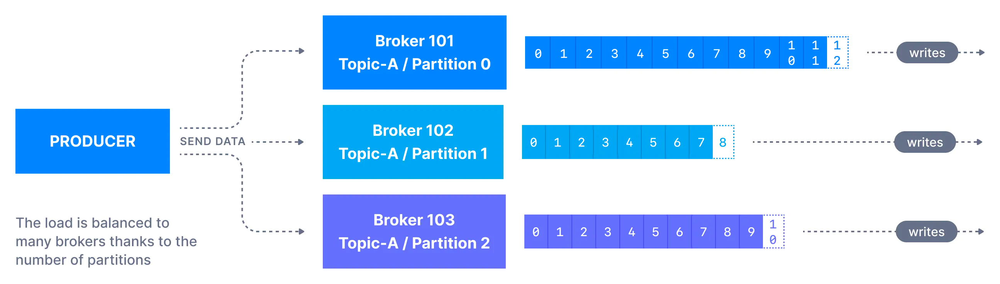
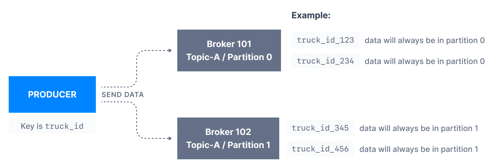
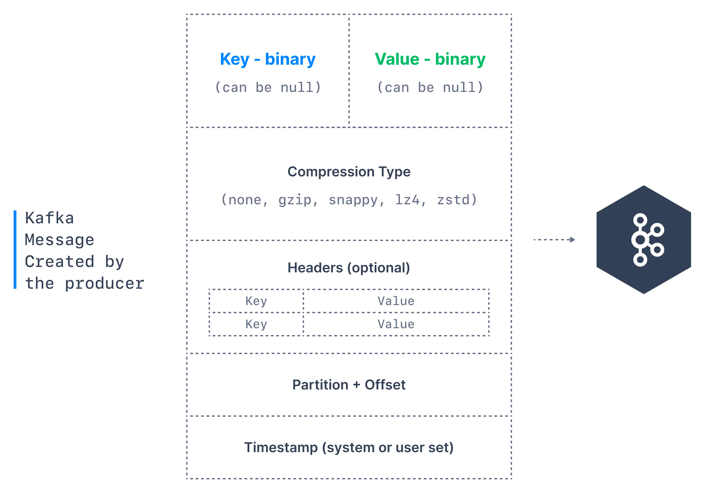

> 시리즈의 이전 문서를 먼저 읽고 오시면 좋습니다. <br>
> * [Apache Kafka 소개 - Part 1](https://bky373.github.io/2022-07-01-introduction-to-apache-kafka-part-1/)
> * [Apache Kafka 소개 - Part 2](https://bky373.github.io/2022-07-02-introduction-to-apache-kafka-part-2/)
> * [Kafka Topic 소개](https://bky373.github.io/2022-07-03-kafka-topics/)
> * [Kafka Producer & Message](https://bky373.github.io/2022-07-04-kafka-producers-and-messages/) - 현재 문서
> * [Kafka Consumer 소개](https://bky373.github.io/2022-07-05-kafka-consumers/)
> * [Kafka Consumer Group & Offset](https://bky373.github.io/2022-07-06-kafka-consumer-group-and-offsets/)
> * [Kafka Broker 소개](https://bky373.github.io/2022-07-07-kafka-brokers/)

카프카에 토픽이 생성되면 다음 단계는 토픽으로 데이터를 보내는 것이다. 이때 프로듀서가 등장한다.

# 1. 카프카 프로듀서 (Producer)

> 카프카 프로듀서에 대한 기본적인
> 설명은 [이전 문서](https://bky373.github.io/2022-10-06-introduction-to-apache-kafka-part-2/)와 동일하다.

프로듀서는 **토픽으로 데이터를 보내는** 역할을 담당한다. 일반적으로 Java, Python, Go와 같은 언어로 된 **카프카 클라이언트 라이브러리**를 애플리케이션에
통합하고, 애플리케이션에 구현된 프로듀서를 사용하여 카프카에 이벤트를 전송한다.



프로듀서가 메시지를 토픽으로 보내면 메시지는 **키 해싱**(key hashing) 등의 메커니즘에 따라 파티션에 배포된다. (자세한 내용은 아래 참조).

메시지가 토픽에 성공적으로 기록되기 위해 생산자가 **승인**(ack) 수준을 지정해야 한다. 이에 대해서 **topic replication** 문서에서 자세히 소개할
예정이다.

# 2. 메시지 키 (Message Keys)

각 이벤트 메시지에는 **키와 값**이 포함된다. 단, 키와 값은 옵셔널한 값이므로 **null** 일 수 있다.

프로튜서가 **키를 지정하지 않은 경우** (**key = null 인 경우**), 메시지는 토픽의 파티션에 **라운드 로빈** 방식으로 고르게 분산된다.
(즉, 메세지가 순서대로 파티션 p0, p1, p2 으로 보내지고, 모든 파티션에 다 보내진 후에 다시 p0 으로 보내진다).

반면, 키를 메시지와 함께 전송하는 경우 (**key != null** 인 경우), **같은 키를 가지는 모든 메시지는 항상 같은 파티션에 전송되고 저장된다**.
키는 메시지를 식별할 수 있게 하는 것이면 어떤 것이든 다 가능하다. (예: 문자열, 숫자 값, 이진 값 등)

키는 **동일한 필드**를 가지는 메시지 처리시 **메시지 순서**가 중요할 때 많이 사용한다.
예를 들어 트럭의 위치를 추적한다고 할 때 각 트럭의 데이터가 일련의 순서를 가지는 것을 원할 수 있다.
이 경우 키를 **truck_id** 로 선택하면 된다. 아래 표시된 예에서 id가 **truck_id_123** 인 트럭의 데이터는 항상 파티션 **p0** 으로 이동한다.



# 3. 메시지 구조 (Structure)

카프카 메시지는 다음 요소로 구성된다.



* **Key**: 키는 메시지에서 선택 사항이고 null 일 수 있다. 키는 문자열, 숫자 또는 어떤 객체도 될 수 있으며 이진 형식으로 직렬화된다.
* **Value**: 값은 메시지의 내용을 나타내며 null 일 수 있다. 값 형식은 사용자가 보내고 싶은 내용에 따라 임의의 내용을 가지며 키와 마찬가지로 이진 형식으로
  직렬화된다.
* **Compression Type(압축 유형)**: 카프카 메시지는 압축될 수 있으며 압축 유형을 **메시지의 일부**로 지정할 수 있다. 선택 가능한 옵션은 none,
  gzip, lz4, snappy 그리고 zstd가 있다.
* **Header**: 키-값 형식으로 카프카 메시지에 헤더 목록을 추가할 수 있다. (옵셔널한 값이므로 추가하지 않아도 된다). **추적**을 쉽게 하기 위해, 헤더에 메시지에
  대한 메타데이터를 지정하여 사용하는 것이 일반적이다.
* **Partition + Offset**: 메시지가 토픽으로 전송되면 파티션 번호와 오프셋 ID를 받는다. **topic + partition + offset** 의 조합은
  메시지를 고유하게 식별한다.
* **timestamp**: 타임스탬프는 사용자나 시스템이 메시지에 추가하는 값이다.

# 4. 메시지 직렬화 (Serialization)

객체에 대한 프로듀서의 코드 표현을 **binary** 로 변환하는 프로세스를 **메시지 직렬화**(message serialization)라고 한다.
많은 프로그래밍 언어에서 키와 값을 객체로 표현하지만 카프카 브로커는 메시지의 키와 값으로 **byte 배열**을 기대하기 때문에 직렬화가 필요하다.

예를 들어 정수 키와 문자열 값을 가진 메시지가 있다고 하자.
키는 정수이므로 IntegerSerializer를 사용하여 바이트 배열로 변환해야 한다. 그리고 값은 문자열이므로 StringSerializer를 활용해야 한다.


Java 클라이언트 SDK에는 이미 문자열(JSON 대체), 정수, 부동 소수점과 같은 여러
[직렬 변환기](https://github.com/a0x8o/kafka/tree/master/clients/src/main/java/org/apache/kafka/common/serialization)
(Serializer) 가 존재한다. 직렬화를 위해 직접 정의한 Serializer를 사용할 수 있지만 일반적으로 효율적으로 구현된 이들 Serializer를 많이 사용한다.

# 5. 메시지 키 해싱 (Key Hashing)

키 해싱(Key Hashing)은 **파티션에 대한 키 매핑**을 결정하는 프로세스다. <br>
**카프카 파티셔너**(kafka Partitioner)에는 레코드를 **어떤 파티션으로 보낼지** 결정하는 코드 로직이 포함되어 있다.


이 로직을 실행할 때 파티셔너는 **메시지의 키**를 활용하여 메시지를 특정 토픽의 파티션에 라우팅한다. 동일한 키를 가진 모든 메시지는 동일한 파티션으로 이동한다.

기본적으로 카프카 파티셔너는 **murmur2 알고리즘**을 사용하여 키를 해시한다. 공식은 아래와 같다.

```java
targetPartition = Math.abs(Utils.murmur2(keyBytes)) % (numPartitions - 1)
```

프로듀서 속성 중 **`partitioner.class`** 를 통해 기본 파티셔너를 재정의할 수 있지만 어떤 작업이 수행되는지 제대로 알지 못하는 경우 사용하지 않는 게 좋다.


# 6. 참고 자료

* [conduktor, kafkademy - Kafka Producers](https://www.conduktor.io/kafka/kafka-producers)
