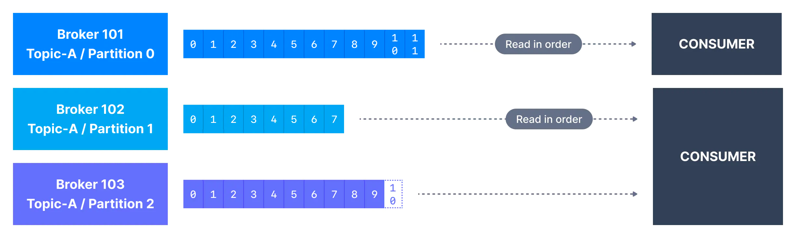
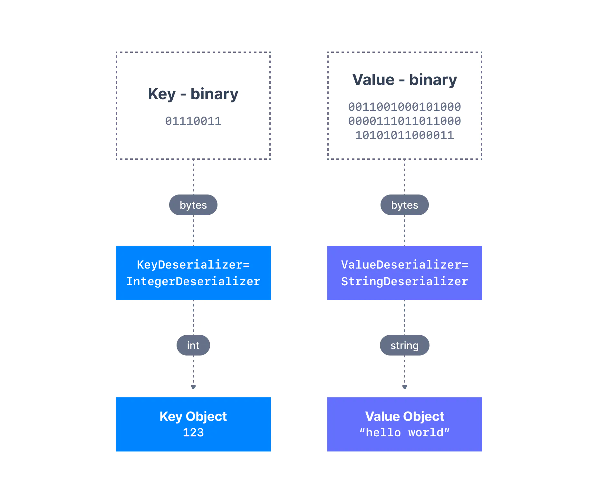

> 시리즈의 이전 문서를 먼저 읽고 오시면 좋습니다.  
> * [Apache Kafka 소개 - Part 1](https://bky373.github.io/2022-07-01-introduction-to-apache-kafka-part-1/)
> * [Apache Kafka 소개 - Part 2](https://bky373.github.io/2022-07-02-introduction-to-apache-kafka-part-2/)
> * [Kafka Topic 소개](https://bky373.github.io/2022-07-03-kafka-topics/)
> * [Kafka Producer & Message](https://bky373.github.io/2022-07-04-kafka-producers-and-messages/)
> * [Kafka Consumer 소개](https://bky373.github.io/2022-07-05-kafka-consumers/) - 현재 문서
> * [Kafka Consumer Group & Offset](https://bky373.github.io/2022-07-06-kafka-consumer-group-and-offsets/)
> * [Kafka Broker 소개](https://bky373.github.io/2022-07-07-kafka-brokers/)

카프카에 토픽이 생성되고 토픽에 데이터가 작성되면 해당 데이터 스트림을 사용하는 애플리케이션을 만들어볼 수 있다.
그리고 이렇게 한 개 이상의 카프카 토픽에서 데이터를 가져와 사용하는 애플리케이션을 **카프카 컨슈머**라고 한다.

# 1. 카프카 컨슈머 (Consumer)

> 카프카 컨슈머에 대한 기본적인
> 설명은 [이전 문서](https://bky373.github.io/2022-10-06-introduction-to-apache-kafka-part-2/)와 동일하다.

카프카 토픽에서 데이터를 읽는 애플리케이션을 **컨슈머**라고 한다.
카프카에서 이벤트를 사용하는 방법은 여러 가지가 있지만 일반적으로, 프로듀서와 같이,
Java, Python, Go와 같은 언어로 된 **카프카 클라이언트 라이브러리**를 애플리케이션에 통합하고 애플리케이션에 구현된 컨슈머를 이용해 이벤트를 사용한다.

컨슈머는 한 번에 **한 개 이상의 파티션**에서 메시지를 읽을 수 있으며 아래와 같이 **각 파티션 내**에서 데이터를 **순서대로** 읽는다.

컨슈머는 항상 **낮은 오프셋에서 높은 오프셋**으로 데이터를 읽는데, 역방향으로는 읽을 수 없다.

컨슈머가 **두 개 이상의 파티션**에서 데이터를 동시에 소비하는 경우 메시지 순서는 여러 파티션 사이에서 보장되지 않는다.
메시지 순서는 오직 **개별 파티션 내에서만** 보장된다.

기본적으로 컨슈머는 카프카에 처음 연결되고 난 이후에 생성된 데이터만 사용한다. 이전 데이터를 읽으려면 커맨드에 input을 따로 지정해야 한다.

컨슈머는 **풀 모델**(pull model)을 구현한다. 즉, 카프카 브로커가 컨슈머에게 계속 데이터를 푸시하는 방식을 사용하지 않는다.
대신 컨슈머가 데이터를 가져오기 위해 **브로커에게 계속 요청**하는 방식을 사용한다.
이러한 구현 방식은 토픽에서 **메시지를 소비하는 속도**를 컨슈머가 제어하기 위해 만들어졌다.

# 2. 카프카 역직렬화 (Deserialization)

카프카 프로듀서가 보내는 데이터는 모두 직렬화 과정을 거친다.
컨슈머가 이러한 데이터를 올바로 소비하기 위해선 직렬화한 것과 동일한 형식으로 **역직렬화**(deserialize) 해야 한다.
그렇게 해야 컨슈머 애플리케이션 내에서 데이터를 유용하게 사용할 수 있다.

* 프로듀서가 IntegerSerializer를 사용하여 정수를 직렬화 했다면 컨슈머는 IntegerDeserializer를 사용하여 역직렬화해야 한다.
* 프로듀서가 StringSerializer를 사용하여 문자열을 직렬화 했다면 컨슈머는 StringDeserializer를 사용하여 역직렬화해야 한다.

토픽의 **직렬화 및 역직렬화 형식은 토픽의 수명주기 동안 변경되어선 안 된다**.
토픽의 데이터 형식을 전환하려는 경우(예를 들어 JSON에서 Avro로 데이터 형식을 전환하려는 경우) 새로운 토픽을 생성하고,
그 토픽을 활용하도록 애플리케이션을 마이그레이션하는 것이 가장 좋다.

> (참고) 서로 합의된 직렬화 형식이 아닌 다른 형식으로 토픽에 전송된 메시지를 poison pills 라고 부른다.

만약 역직렬화에 실패하면 애플리케이션 내부에서 충돌이 나거나 일관성 없는 데이터가 발생할 수 있다. 
이는 디버그하기 어려울 수 있므로 코드를 처음 작성할 때 논의된 형식을 잘 지키고 있는지 확인해봐야 한다.

# 3. 참고 자료

* [conduktor, kafkademy - Kafka Consumers](https://www.conduktor.io/kafka/kafka-consumers)
