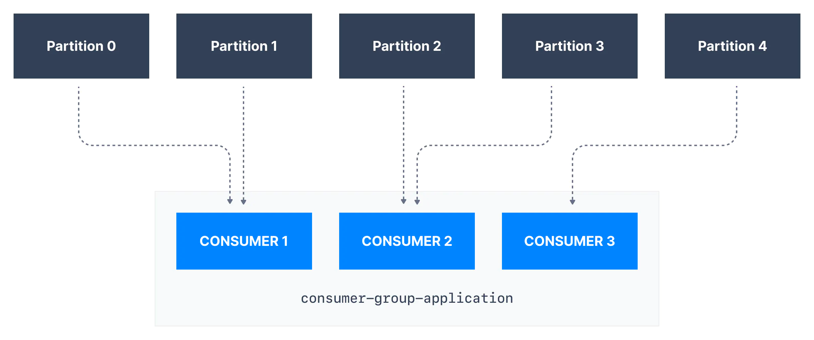
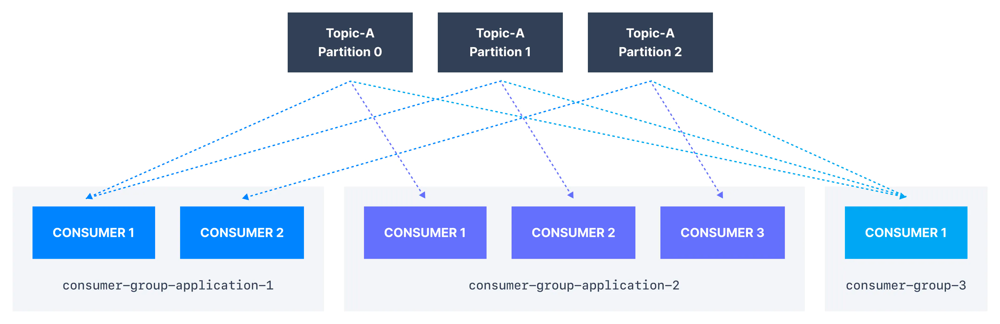
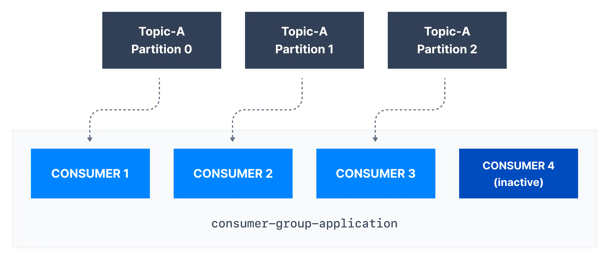
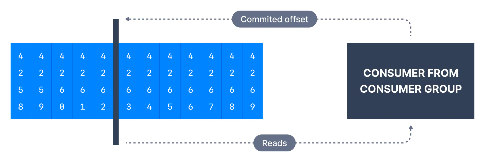

> 시리즈의 이전 문서를 먼저 읽고 오시면 좋습니다.  
> * [Apache Kafka 소개 - Part 1](https://bky373.github.io/2022-07-01-introduction-to-apache-kafka-part-1/)
> * [Apache Kafka 소개 - Part 2](https://bky373.github.io/2022-07-02-introduction-to-apache-kafka-part-2/)
> * [Kafka Topic 소개](https://bky373.github.io/2022-07-03-kafka-topics/)
> * [Kafka Producer & Message](https://bky373.github.io/2022-07-04-kafka-producers-and-messages/)
> * [Kafka Consumer 소개](https://bky373.github.io/2022-07-05-kafka-consumers/)
> * [Kafka Consumer Group & Offset](https://bky373.github.io/2022-07-06-kafka-consumer-group-and-offsets/) - 현재 문서
> * [Kafka Broker 소개](https://bky373.github.io/2022-07-07-kafka-brokers/)

# 1. 카프카 컨슈머 그룹

토픽은 대개 많은 파티션으로 구성된다. 파티션으로 나누는 이유는 카프카 컨슈머가 데이터를 **병렬적으로 처리**할 수 있도록 하기 위함이다.
컨슈머가 동일한 논리적 작업을 수행한다면 수평 확장성을 위해 하나의 카프카 **컨슈머 그룹**을 구성하는 것이 좋다.

컨슈머 그룹을 사용하면 그룹 내에 있는 컨슈머는 다른 파티션으로부터 데이터를 가져오는 작업을 적절히 나누어 수행한다.

# 2. 컨슈머 그룹 아이디 (Group ID)

컨슈머 설정에서 `group.id` 를 설정하면 특정 컨슈머가 **어느 그룹**에 속해 있는지 알 수 있다.
다른 컨슈머라도 동일한 그룹 아이디를 가지고 있으면 해당 컨슈머는 같은 그룹에 속한다.

컨슈머를 **파티션에 할당**하는 작업은 **GroupCoordinator**와 **ConsumerCoordinator**에 의해 이루어진다.
또한, 이들을 통해 같은 그룹에 있는 컨슈머들이 **로드 밸런싱** 된다.
> Coordinator의 구체적인 동작은
[이곳](https://developer.confluent.io/learn-kafka/architecture/consumer-group-protocol/)을 참고하자.
> 자세한 내용은 시리즈를 마친 후에 따로 포스팅할 예정이다.

눈여겨볼 점이 하나 있다. `하나의 파티션은 같은 컨슈머 그룹 안에서 하나의 컨슈머에만 할당될 수 있다.`
하지만 `하나의 컨슈머에는 여러 개의 파티션이 할당될 수 있다.` (굳이 대입하면 **컨슈머와 파티션의 연관관계**는 **1:N** 이다).

위의 예시를 보면, **consumer-group-application** 이라는 그룹 아이디를 가진 컨슈머 그룹에서 `Consumer 1`은 파티션 0과 파티션 1을 할당받았다.
`Consumer 2`는 파티션 2와 파티션 3을 할당받았고 마지막으로 `Consumer 3`은 파티션 4를 할당받았다.

따라서 오직 `Consumer 1`만 파티션 0과 1의 메시지를 수신받을 수 있고, 오직 `Consumer 2`만 파티션 2와 3의 메시지를 수신받을 수 있다.
마찬가지로 오직 `Consumer 3`만 파티션 4의 메시지를 수신받을 수 있다.

여기까지는 **동일한 작업**을 수행하는 여러 개의 컨슈머가 하나의 토픽 메시지를 병렬 처리하는 방법에 대해 알아보았다.

그런데 만약 **다른 작업**을 수행하는 여러 개의 애플리케이션이 하나의 토픽 메시지를 받아보게 하고 싶다면 어떻게 해야 할까?
답은 간단하다. 애플리케이션마다 다른 `group.id`를 지정하면 된다.
그룹 아이디가 다르면 아래와 같이 하나의 토픽은 여러 개의 컨슈머 그룹을 동시에 연결할 수 있다.

토픽의 파티션 수보다 컨슈머가 더 많을 경우 (파티션 수 < 컨슈머 수 인 경우)를 생각해보자. 일부 컨슈머는 아래와 같이 비활성화된다.
따라서 처리량을 높이기 위해 컨슈머 수를 늘리는 경우 더 많은 파티션을 생성해야 할 수 있다.
그렇지 않으면 일부 소비자가 비활성 상태로 남아 있게 된다.

# 3. 컨슈머 오프셋 (Offsets)

컨슈머는 토픽의 파티션 별로 메시지를 어디까지 소비했는지 체크하기 위해 메시지 위치 정보인 **오프셋 ID를 커밋**한다.
(토픽의 각 메시지가 **파티션 ID**와 **오프셋 ID**를 가지고 있기 때문에 이들을 사용하여 커밋할 수 있다. 커밋은 쉽게 말해 메시지 위치 정보를 업데이트 하는 것이다).
이때 커밋되는 오프셋을 **컨슈머 오프셋**(consumer offset)이라 한다.

예를 들어 컨슈머가 오프셋 4262까지 메시지를 커밋한다면 **컨슈머 오프셋**은 4262로 설정된다.

0.9 이전 버전의 컨슈머는 오프셋 정보를 주키퍼에 저장했다. 하지만 성능 등의 이슈로 이후 버전의 컨슈머는
카프카 내부 토픽(`__consumer_offsets`)에 오프셋 정보를 저장한다.

**오프셋은 컨슈머 그룹 내에서 리밸런싱이 일어날 때 매우 중요하다.**  
예를 들어, 커밋된 오프셋이 컨슈머가 마지막으로 처리한 오프셋보다 작으면 마지막으로 처리된 오프셋과 커밋된 오프셋 사이의 메시지는 중복으로 처리된다.
반대로 커밋된 오프셋이 컨슈머가 마지막으로 처리한 오프셋보다 크면 마지막으로 처리된 오프셋과 커밋된 오프셋 사이의 모든 메시지는 누락된다.

오프셋을 정상적으로 커밋하려면 커밋 방법을 잘 정해야 한다. 커밋 방법에는 자동 커밋 또는 수동 커밋 방법이 있는데 이에 대해선 추후 알아보기로 하자.

# 4. 참고 자료

* [conduktor, kafkademy - Kafka Consumer Groups & Offsets](https://www.conduktor.io/kafka/kafka-consumer-groups-and-consumer-offsets)
* [Kafka 커밋과 오프셋 (Commit & Offset)](https://goodgid.github.io/Kafka-Commit-Offset/)
