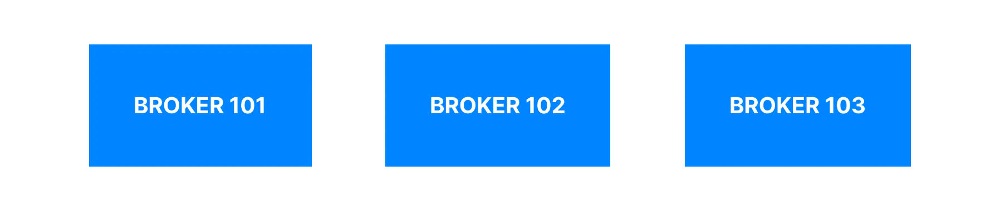
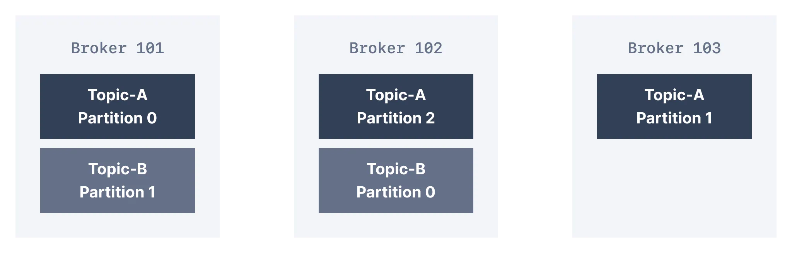
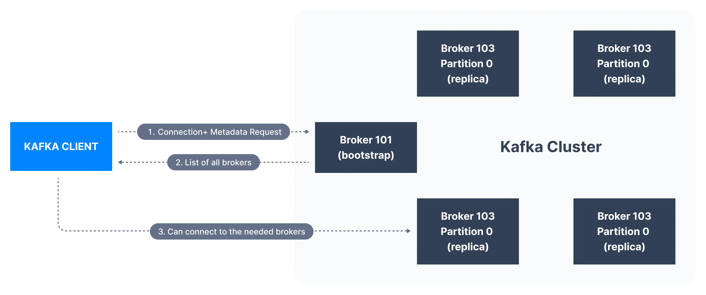

> 시리즈의 이전 문서를 먼저 읽고 오시면 좋습니다.  
> * [Apache Kafka 소개 - Part 1](https://bky373.github.io/2022-07-01-introduction-to-apache-kafka-part-1/)
> * [Apache Kafka 소개 - Part 2](https://bky373.github.io/2022-07-02-introduction-to-apache-kafka-part-2/)
> * [Kafka Topic 소개](https://bky373.github.io/2022-07-03-kafka-topics/)
> * [Kafka Producer & Message](https://bky373.github.io/2022-07-04-kafka-producers-and-messages/)
> * [Kafka Consumer 소개](https://bky373.github.io/2022-07-05-kafka-consumers/)
> * [Kafka Consumer Group & Offset](https://bky373.github.io/2022-07-06-kafka-consumer-group-and-offsets/)
> * [Kafka Broker 소개](https://bky373.github.io/2022-07-07-kafka-brokers/) - 현재 문서

# 1. 카프카 브로커 (Broker)

단일 카프카 서버를 **카프카 브로커**(Kafka broker, 이하 브로커)라고 한다.
브로커는 JVM(Java 버전 11+)에서 실행되는 프로그램이며 일반적으로 브로커가 되는 서버는 필요한 프로그램만 실행하고 다른 것은 실행하지 않는다.

# 2. 카프카 클러스터 (Cluster)

(한 개 또는 여럿이서 함께) 작동하는 브로커의 총체를 가리켜 **카프카 클러스터**(이하 클러스터)라고 한다.
일부 클러스터에는 하나의 브로커만 포함되고 다른 클러스터에는 3개 또는 수백 개의 브로커가 포함될 수 있다.
Netflix나 Uber 같은 회사는 수백 또는 수천 개의 브로커를 실행하여 데이터를 처리한다.

클러스터의 브로커는 **고유한 숫자 ID**로 식별된다. 아래 그림에서 클러스터는 3개의 브로커로 구성된다.

# 3. 브로커와 토픽

브로커는 서버 디스크의 디렉토리에 데이터를 저장한다.
각 토픽-파티션은 토픽과 연관된 이름의 하위 디렉토리를 받는다.
카프카가 데이터를 어떻게 저장하는지에 대한 자세한
설명은 [이곳](https://www.conduktor.io/kafka/kafka-topics-internals-segments-and-indexes)을 참고하자.

토픽에 대해 높은 처리량과 확장성을 달성하려면 토픽을 나눠야 한다.
만약 클러스터에 여러 개의 브로커가 있는 경우 **로드 밸런싱**과 **확장성**을 위해 토픽의 각 파티션이 브로커 사이에 고르게 분산된다.

위의 그림에서 Topic-A는 3개의 파티션을 가지고 있다.
이들 파티션은 클러스터 내에 있는 3개의 브로커에 균등하게 분배되었다.

한편, 다른 경우 클러스터의 브로커 수보다 토픽의 파티션이 더 적거나 더 많을 수 있다.
Topic-B는 2개의 파티션으로 분할되고 각 파티션이 Brokder 101와 102에 분배되었지만 Broker 103에는 분배되지 않았다.

여기서 브로커 ID와 파티션 ID는 서로 관련이 없다. 카프카는 ID끼리 매칭하지 않고도 사용 가능한 브로커 간에 파티션을 고르게 잘 분배한다.
특히 특정 브로커의 **과부하**로 인해 클러스터가 불균형해질 경우 카프카 관리자는 클러스터를 **재조정**하고 파티션을 안전하게 이동시킨다.

# 4. 카프카 클러스터 연결

카프카 클라이언트는 어떻게 클러스터(부트스트랩 서버)에 연결할 수 있을까?
(클러스터의 모든 브로커를 **부트스트랩 서버**(bootstrap servers)라고 한다).

클러스터에서 메시지를 보내거나 받으려는 클라이언트는 **클러스터의 모든 브로커에 연결할 수 있다**.
클러스터의 모든 브로커에는 다른 모든 브로커에 대한 메타데이터가 있기 때문이다.
이는 클라이언트가 서로 다른 브로커에 연결하는 데 도움이 된다.

아래 그림에서 부트스트랩 서버는 클러스터의 모든 브로커 목록의 **메타데이터**를 클라이언트에 반환한다.
그리고 클라이언트는 데이터를 보내거나 받을 때 이 메타데이터를 활용한다.
클라이언트는 관련 토픽-파티션이 포함된 브로커를 정확히 찾기 위해 메타데이터를 사용한다.

일반적으로 카프카 클라이언트는 connection URL에서 **적어도 두 개 이상의 부트스트랩 서버**를 참조한다.
그 중 하나를 사용할 수 없는 경우 다른 하나는 연결 요청에 계속 응답할 수 있어야 하기 때문이다.

하지만 카프카 클라이언트가 클러스터에 있는 모든 브로커의 모든 호스트 이름을 알 필요는 없다. 대신 connection 문자열에서 
2개 또는 3개의 브로커 주소를 참조할 수 있어야 한다.

# 5. 참고 자료

* [conduktor, kafkademy - Kafka Brokers](https://www.conduktor.io/kafka/kafka-brokers)
