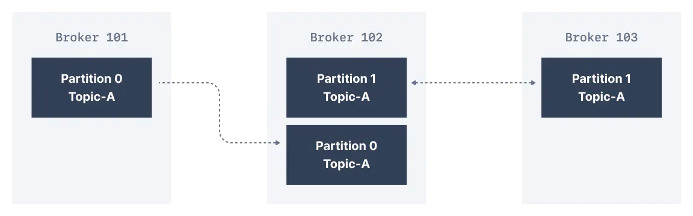
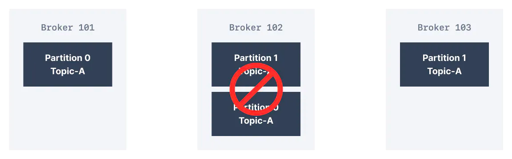

> 시리즈의 이전 문서를 먼저 읽고 오시면 좋습니다.  
> * [Apache Kafka 소개 - Part 1](https://bky373.github.io/2022-07-01-introduction-to-apache-kafka-part-1/)
> * [Apache Kafka 소개 - Part 2](https://bky373.github.io/2022-07-02-introduction-to-apache-kafka-part-2/)
> * [Kafka Topic 소개](https://bky373.github.io/2022-07-03-kafka-topics/)
> * [Kafka Producer & Message](https://bky373.github.io/2022-07-04-kafka-producers-and-messages/)
> * [Kafka Consumer 소개](https://bky373.github.io/2022-07-05-kafka-consumers/)
> * [Kafka Consumer Group & Offset](https://bky373.github.io/2022-07-06-kafka-consumer-group-and-offsets/)
> * [Kafka Broker 소개](https://bky373.github.io/2022-07-07-kafka-brokers/)
> * [Kafka Topic Replication](https://bky373.github.io/2022-07-08-kafka-topic-replication/) - 현재 문서

카프카가 인기 있는 주요 이유 중 하나는 브로커의 실패에 직면했을 때 제공하는 **회복력**(resilience) 떄문이다.
카프카는 가동 시간과 데이터 정확성을 유지하면서 오류를 견딜 수 있도록 복제 기능을 고려하여 설계되었다.

# 1. Kafka Topic Replication Factor

> **카프카 복제**  
> 데이터 복제는 둘 이상의 브로커에 동일한 데이터를 기록하여 데이터 손실을 방지한다.

카프카에서 **복제**(replication)는 데이터가 하나의 브로커가 아니라 여러 브로커에 기록되는 것을 의미한다.

**복제 계수**(replication factor)는 토픽과 관련된 설정이며 토픽 생성 시 지정된다.
* **복제 계수 1**은 복제가 없음을 의미한다. 주로 개발 목적으로 사용되며 프로덕션에서는 피해야 한다. 
* **복제 계수 3**은 브로커 손실과 복제 오버헤드 간의 적절한 균형을 제공하기 때문에 일반적으로 많이 사용된다.

아래 3개의 브로커로 구성된 클러스터에서 복제 계수는 2이다. 
메시지가 Broker 101에서 Topic-A의 Partition 0에 기록될 때, Partition 0을 복제본으로 가지기 때문에 Broker 102에도 기록된다.

복제 계수 2 덕분에 한 개의 브로커가 실패해도 견딜 수 있다. 
아래 그림에서는 Broker 102가 실패해도 Broker 101과 103에 데이터가 계속 남아 있음을 보여준다.

# 2. Kafka 파티션 리더 및 복제본(Replicas)

주어진 토픽-파티션에 대해 클러스터는 하나의 특정 브로커를 지정하여 클라이언트에 데이터를 보내거나 받도록 한다. 
그리고 이러한 브로커를 해당 토픽-파티션의 **리더 브로커**(leader broker)라고 한다. 
또한 같은 파티션에 대해 복제된 데이터를 저장하는 다른 브로커를 **복제본**(replica)이라고 한다.

따라서 각 파티션에는 **하나의 리더**와 **여러 개의 복제본**이 존재한다.

# 3. 동기식 복제본(In-Sync Replicas)

**ISR**(In-Sync Replicas)은 하나의 파티션에 대해 리더 브로커가 가지고 있는 최신 상태를 동기화한 복제본을 의미한다. 
리더와 동일하게 최신 상태를 가지지 않은 모든 복제본은 동기화되지 않은 상태

# 4. 참고 자료

* [conduktor, kafkademy - Kafka Topic Replication](https://www.conduktor.io/kafka/kafka-topic-replication)
