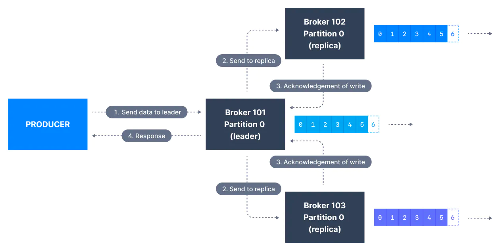
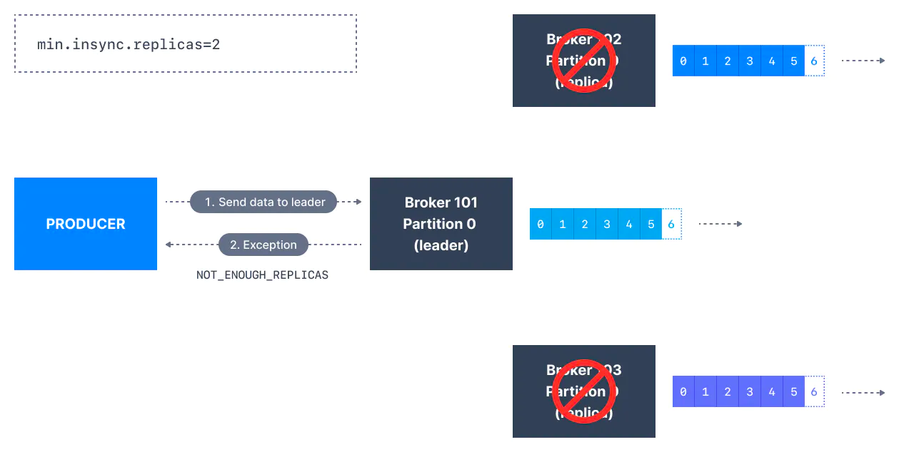

# 1. 개요
* Kafka Topic Configuratioin 파라미터 중 하나인 **acks** 에 대해 알아본다.
* acks 와 함께 작동하는 **min.insync.replicas** 에 대해서도 알아본다.
* 또한 이들을 통해 **메시지 안전성**을 개선할 수 있다는 것을 이해한다.

# 2. Acks
* 카프카 프로듀서는 기본적으로 **파티션의 현재 Leader 브로커** 에만 데이터를 작성(write) 한다.
* 메시지 작성(wirte) 이 성공했는지 어떻게 판단할 수 있을까? 
  * 이는 **acks (acknowledgmnet 수준)** 을 어떻게 설정하냐에 따라 다르다. 
  * 최소 몇 개의 복제본에 메시지가 작성되어야 하는지를 결정할 때 **acks** 를 설정한다. 
  * **acks** 의 기본값은 버전에 따라 다르다.
    * Kafka < v3.0 -> acks = 1  
    * Kafka >= v3.0 -> acks = all

## 2.1. acks=0
* acks=0 인 경우 프로듀서는 브로커가 메시지를 수락할 때까지 기다리지 않고 **메시지가 전송된 순간** 메시지를 "성공적으로 작성" 한 것으로 간주한다.
  
  > [이미지 출처](https://www.conduktor.io/kafka/kafka-topic-configuration-min-insync-replicas)
* 보내는 순간 성공 처리를 하기 때문에 브로커가 죽거나 예외가 발생한 경우에 데이터를 잃어버려도 알 길이 없다.
* 따라서 메트릭 수집과 같이 메시지가 손실되어도 괜찮은 경우 또는 처리량(throughput)을 최대치로 끌어올려야 하는 경우가 아니면 메시지 안전성 측면에서 위험하다. 
  * 처리량(throughput)을 최대치로 끌어올릴 수 있는 이유는 네트워크 오버헤드(overhead)가 없기 때문이다.

## 2.2. acks=1
* acks=1 인 경우 프로듀서는 **Leader 가 메시지를 수락했다는 신호를 보낼 때** 메시지를 "성공적으로 작성" 한 것으로 간주한다.
  
  > [이미지 출처](https://www.conduktor.io/kafka/kafka-topic-configuration-min-insync-replicas)
* ack 응답을 받지 못한 프로듀서는 요청을 다시 시도한다.
* 하지만 Leader 브로커에 응답이 요청된다고 해서 복제(replication)가 항상 이루어지는 것은 아니다.
* 복제본이 아직 복제를 하지 못한 상황에서 Leader 브로커가 죽으면 데이터가 손실된다.

## 2.3. acks=all
* acks=all인 경우 프로듀서는 **모든 ISR(In-Sync Replicas, 동기화 복제본)에서 메시지를 수락할 때** 메시지를 "성공적으로 작성" 한 것으로 간주한다.
  
  > [이미지 출처](https://www.conduktor.io/kafka/kafka-topic-configuration-min-insync-replicas)
* Partition 의 Lead 복제본은 (메시지를 안전하게 쓸 수 있는) 동기화된 복제본이 충분한지 확인한다.
  * 브로커 설정 **min.insync.replicas** 에 의해 제어된다.
* 한 번 들어온 요청은 Leader 가 복제본이 메시지를 복제한 것을 관찰할 때까지 버퍼에 저장되고, 이 시점에서 메시지 작성에 성공했다는 신호가 클라이언트로 전송된다.
* **min.insync.replicas** 는 토픽과 브로커 레벨에서 모두 구성할 수 있다.
* 데이터는 모든 동기화된 복제본에 기록될 때 커밋된 것으로 간주된다.
* **min.insync.replicas = 2** 이면, 리더를 포함하여 ISR인 **브로커 최소 2개** 가 데이터를 가지고 있다고 응답해야 한다.
* committed data 가 둘 이상의 복제본에 기록되도록 하려면 동기화된 복제본의 최소 수를 더 높은 값으로 설정해야 한다.
* 토픽에 3개의 복제본(replica)이 있고, **min.insync.replicas** 을 **2** 로 설정하면, 3개의 복제본 중 2개 이상이 동기화된 경우에만 토픽의 파티션에 메시지를 작성할 수 있다.
* 세 개의 복제본이 모두 동기화(in-sync)된 경우면 당연히 모든 것이 정상적으로 진행된다.
* 복제본 중 하나를 사용할 수 없게 되더라도 아직까지는 괜찮다.
* 하지만 3개의 복제본 중 2개를 사용할 수 없는 경우 브로커는 더 이상 메시지 생성 요청을 수락하지 않는다.
* 데이터 전송을 시도하는 프로듀서는 이때 요청 수락 신호 대신 **NotEnoughReplicasException** 을 받는다.

# 3. Kafka Topic 내구성 및 가용성
* 토픽 복제 계수(replication factor)가 3인 경우의 토픽 데이터 내구성을 표현하면 2개의 브로커 손실을 견딜 수 있는 정도다.
* 일반적으로 복제 팩터가 N인 경우 최대 N-1개의 브로커를 영구적으로 손실해도 데이터를 복구할 수 있다.
* 복제 계수가 3인 경우 가용성은 어떨까? 아래 내용이 이를 설명한다.
* **읽기(Reads)** : 하나의 파티션이 살아있고, ISR(In-Sync Replicas, 동기화 복제본)로 간주되는 한 해당 토픽을 read 용도로 쓸 수 있다.  
* **쓰기(Writers)**
  * **acks=0 & acks=1** : 하나의 파티션이 살아있고, ISR(In-Sync Replicas, 동기화 복제본)로 간주되는 한 해당 토픽을 write 용도로 쓸 수 있다.
  * **acks=all** :
    * **min.insync.replicas=1 (default)** : 토픽에는 ISR(리더 포함)인 파티션이 최소 1개 있으면 되므로 브로커 2개가 다운되는 것이 허용된다. 
    * **min.insync.replicas=2** : 토픽에는 최소 2개의 ISR 이 있어야 하므로 (복제 계수가 3인 경우) 최대 1개의 브로커가 다운되는 것이 허용된다. 모든 write 동작이 최소 2번 이루어진다.   
    * **min.insync.replicas=3** : 복제 계수가 3인 경우 의미가 없으며 write 하기 위해 어떤 브로커도 다운되어서는 안 된다.   
    * 요약하면 **acks=all** 일 때 **replication.factor=N, min.insync.replicas=M** 인 경우 가용성을 위해 최대 **N-M** 개의 브로커가 다운되는 것이 허용된다.

> **많이 사용하는 구성**
> * **acks=all**, **min.insync.replicas=2** 
> * 위 구성이 데이터 내구성과 가용성을 지키기 위해 가장 널리 사용되는 구성이며, 이 구성을 사용하면 최대 한 개까지 브로커 손실을 견딜 수 있다.

# 4. Topic Configuration 기본값 재정의
* 해당 실습 내용은 [이곳](https://www.conduktor.io/kafka/kafka-topic-configuration-min-insync-replicas)을 참고하자.

# 5. 참고 자료
* [Kafka Topic Configuration: Minimum In-Sync Replicas](https://www.conduktor.io/kafka/kafka-topic-configuration-min-insync-replicas)
