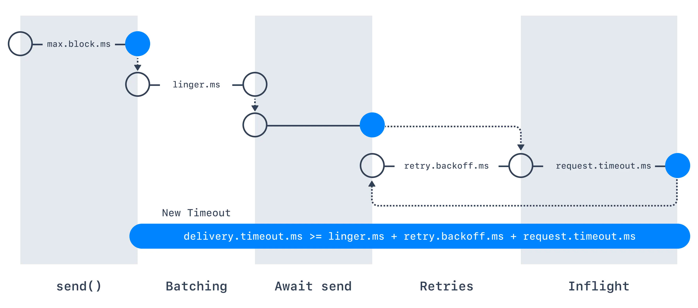

# 1. 개요
* 카프카 프로듀서의 재시도 설정에 필요한 구성 요소들을 살펴본다.

# 2. Broker Error Code
* 카프카 프로듀서가 브로커에 메시지를 보내면 브로커는 성공 또는 오류 코드를 반환한다.
* 이중 오류 코드는 크게 두 가지 카테고리로 나눌 수 있다.
  * **재시도 가능 오류 (Retriable errors)**
    * 재시도 후 해결할 수 있는 오류다.
    * 예를 들어 브로커가 NotEnoughReplicasException 예외를 반환하면 프로듀서는 메시지 수락을 한 번 더 요청 한다. 이 시점에 죽어있던 복제본 브로커가 다시 살아날 경우 두 번째 시도가 성공할 수 있다. 
  * **재시도 불가능 오류 (Nonretriable error)**
    * 재시도로 해결할 수 없는 오류다.
    * 예를 들어 브로커가 INVALID_CONFIG 예외를 반환하는 경우 동일한 요청을 다시 해도 요청 결과가 달라지지 않는다.
* 아파치 카프카로 메시지를 보낼 때 메시지가 누락되지 않도록 재시도를 활성화 하는 것이 좋다. 

# 3. Producer Retry Configurations
## 3.1. 요약
* 안전한 Retry 를 하려면 다음 구성을 설정하자.
  ```
  // create safe Producer
  properties.setProperty(ProducerConfig.ENABLE_IDEMPOTENCE_CONFIG, "true");
  properties.setProperty(ProducerConfig.ACKS_CONFIG, "all");
  properties.setProperty(ProducerConfig.RETRIES_CONFIG, Integer.toString(Integer.MAX_VALUE));
  properties.setProperty(ProducerConfig.MAX_IN_FLIGHT_REQUESTS_PER_CONNECTION, "5"); // 특정 버전 또는 특정 상황에서는 1을 사용한다.
  ```
## 3.2. retries
* **retries** 는 프로듀서가 메시지 전송을 실패로 마킹하기 전에 메시지를 얼마나 전송할지 결정하는 설정이다.
* 0보다 크게 설정하면, 클라이언트는 일시적인 오류로 인해 전송에 실패한 모든 레코드를 다시 전송한다.
* **max.in.flight.requests.per.connection** 을 1로 설정하지 않고 재시도를 허용할 경우 레코드 순서가 변경될 수 있다.
* 단일 파티션에 두 개의 배치를 전송할 때, 첫 번째는 실패 후 재시도하지만 두 번째는 성공한 경우면, 두 번째 배치에 있는 레코드를 먼저 기록할 수 있기 때문이다.
* 추가로 주의할 점은, **delivery.timeout.ms** 로 설정한 제한 시간이 승인(acknowledgement)을 완료하기 전에 먼저 만료되면, 재시도 횟수만큼 요청을 보내기 전에 생성 요청이 실패한다.
* 일반적으로 이 구성을 설정하지 않은(unset) 상태로 두고, **delivery.timeout.ms** 로 **retries** 동작을 제어하는 걸 권장한다.
* 기본값은 아래와 같다.
   * Kafka <= 2.0 -> 0
   * Kafka >= 2.1 -> MAX_INT (2147483647)

## 3.3. delivery.timeout.ms
* **send()** 호출이 반환된 후 성공 혹은 실패를 보고하는 시간의 상한. 
  
  > [이미지 출처](https://www.conduktor.io/kafka/kafka-producer-retries) 
* 이 설정은 실제 전송에 이르기 전 레코드가 지연되는 시간, 브로커 승인(acknowledgement)을 기다리는 시간, 전송 실패 후 재시도에 걸리는 시간을 제한한다.
* 복구할 수 없는 오류를 만나거나, 재시도 횟수를 모두 소진하거나, 만료 기한이 더 이른 배치에 레코드가 추가된 경우 프로듀서는 제한시간 안에 레코드를 보내지 못했다고 보고할 수 있다.
* 이 값은 **request.timeout.ms** 와 **linger.ms** 를 합친 값보다 크거나 같아야 한다.
* 기본값은 120000ms (2 minutes) 이다.

## 3.4. retry.backoff.ms
* 프로듀서가 주어진 토픽 파티션에 실패한 요청을 재시도하기 전에 대기하는 시간이다.
* 특정 실패 시나리오에서 (리소스를 차지하며) 타이트하게 반복 요청을 보내는 것을 방지한다.
* 기본값은 100ms 이다.

## 3.5. max.in.flight.requests.per.connection
* 클라이언트가 단일 커넥션에 보낼 승인되지 않은(unacknowledged) 요청의 최대 개수 로, 이 값을 넘기면 블로킹된다.  
* 이 값을 1보다 크게 설정했는데 전송이 실패한 경우 재시도(재시도가 활성화된 경우)로 인해 메시지가 다시 정렬될 위험이 있다. (키 기반 순서(key-based ordering) 에 의존하는 경우 문제가 될 수 있다.) 
* max.in.flight.requests.per.connection = 1로 설정하여 메시지 순서를 보장 받을 순 있지만, 처리량이 크게 감소할 수 있다.
* 기본값은 5 이다.
* **(매우 중요)** **enable.idempotence = true** 일 경우 **max.in.flight.requests.per.connection** 은 5보다 작거나 같아야 하며 **허용 가능한 값(allowable value) 에 대해 메시지 순서가 유지되어야 한다!** (allowable value 의 의미를 정확히 이해하진 못했다.)

# 4. 참고 자료
* [Kafka Producer Retries](https://www.conduktor.io/kafka/kafka-producer-retries)
* [Apache Kafka Producer Configurations](https://kafka.apache.org/27/documentation.html#producerconfigs)
* [토리맘의 한글라이즈 프로젝트 - Apache Kafka Producer Configurations](https://godekdls.github.io/Apache%20Kafka/producer-configuration)
