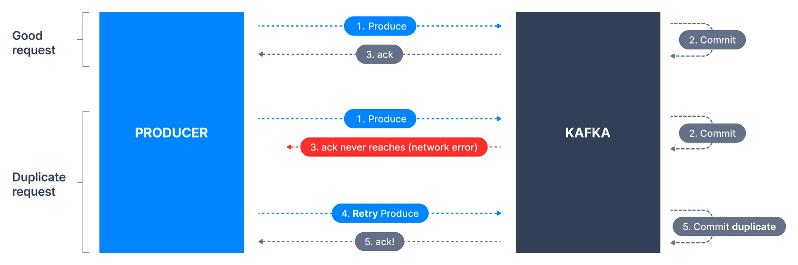
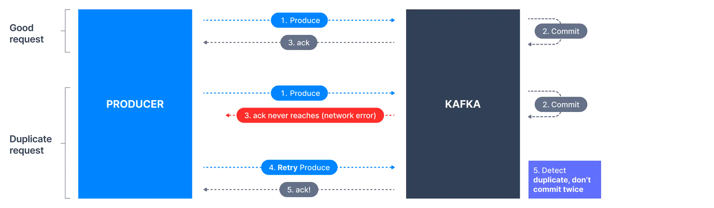

# 1. 개요
* 카프카 프로듀서의 멱등성이 무엇인지 이해한다. 
* 메시지 중복 발행을 피하는 설정에 대해 알아본다.

# 2. 재시도 문제
* 전송 실패한 메시지를 다시 보낼 경우 첫 번째 요청한 메시지와 그 다음에 요청한 메시지가 브로커에 중복 복제될 위험이 있다.
* **[예시 플로우]**
  * (1) 프로듀서가 카프카에 메시지를 보낸다.
  * (2) 첫 메시지가 "성공적으로 작성" 되었고 복제되었다.
  * (3) 네트워크 이슈로 브로커 승인(acknowledgment) 응답이 프로듀서에 도달하지 못했다.
  * (4) 프로듀서는 이를 일시적인 네트워크 장애로 보고 다시 메시지를 보낸다. (수신되었는지 알 수 없기 때문이다.)
  * (5) 이 경우 브로커는 동일한 메시지를 두 번 받는다.


> [이미지 출처](https://www.conduktor.io/kafka/idempotent-kafka-producer)

# 3. Kafka Idempotent Producer
> Kafka 버전 >= 0.11에서 프로듀서 멱등성을 활성화할 수 있다.

* 프로듀서 멱등성은 예기치 않은 재시도로 인한 **메시지 중복** 을 방지한다.


> [이미지 출처](https://www.conduktor.io/kafka/idempotent-kafka-producer)
* 
* 위의 사진과 달리 단계 (5)에서 메시지 복제가 진행되지 않는다.

## 3.1. 내부 동작 방식
* **enable.idempotence = true** 이면 프로듀서가 브로커에 메시지를 보낼 때마다 각 프로듀서에 **PID(Producer Id)** 가 할당되고 PID 가 포함된다.
* 또한 각 메시지는 단조적(monotonically)으로 증가하는 **시퀀스 번호(sequence number)** 를 얻는다. (이는 오프셋과 달리 프로토콜 목적으로만 사용된다.)
* 이에 따라 프로듀서와 연결된 각 토픽 파티션마다 별도의 순서가 유지된다.
* 브로커는 파티션별로 "성공적으로 작성" 된 메시지의 가장 큰 PID-시퀀스 번호 조합을 추적하고, 낮은 시퀀스 번호의 메시지가 들어오면 이를 폐기한다.

## 3.2. 멱등성 활성화 방법
> Kafka 3.0 버전부터는 기본적으로 **enable.idempotence=true** 및 **acks=all** 설정을 갖는다.

* 이미 **acks=all** 을 사용하고 있다면 멱등성 기능을 활성화해야 한다. 기능을 켜려면 프로듀서 구성 중 **enable.idempotence=true** 를 사용하기만 하면 된다.
  ```java
  // create Producer properties
  Properties properties = new Properties();
        
  properties.setProperty(ProducerConfig.ENABLE_IDEMPOTENCE_CONFIG, "true");
  ```
* 전반적으로 모든 프로듀서에 대해 멱등성을 활성화하는 것이 좋다.

# 4. 참고 자료
* [Conduktor - Idempotent Kafka Producer](https://www.conduktor.io/kafka/idempotent-kafka-producer)
* [Apache Kafka Producer Configurations](https://kafka.apache.org/27/documentation.html#producerconfigs)
