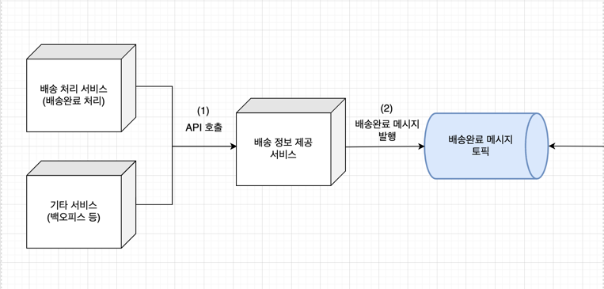
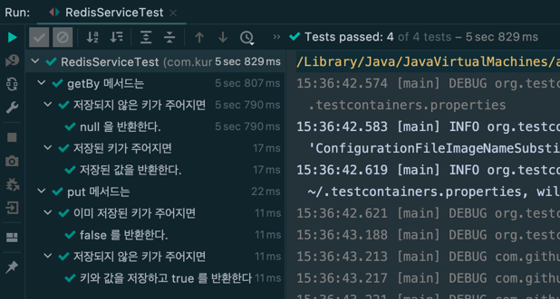

# 1. 작업 배경
* 현재 회사에서 주문의 **배송 처리 서비스** 를 담당하고 있다.
* **배송 처리 서비스**는 여러 가지 일을 맡고 있는데, 그중 주문의 **배송완료 처리** 도 맡고 있다.
* **배송완료 처리**를 수행하면 최종적으로 주문의 **배송완료 정보**가 생성되고, 이 정보는 여러 도메인(예, 적립금, 회원 도메인) 에 전달된다. 큰 틀에서 아래 플로우로 작업이 이루어진다고 보면 된다.
  * **배송 처리 서비스**에서 배송완료 처리 -> **배송완료 정보 제공 서비스** API 호출 -> **카프카 배송완료 메시지 발행**
  * **배송완료 정보**에 기반해 고객에게 적립금을 지급하거나 첫 구매 혜택을 적용할 수 있기 때문에 타 도메인에서는 발행된 메시지를 구독한다.



* 이 작업에는 한 가지 요구사항이 있었는데, 적립금이 두 번 적립되거나 할 수 있기 때문에 **배송완료 정보를 주문당 단 한 번씩만 발행해야 한다**는 것이었다. 
  * 물론 적립금 서비스에는 방어 로직이 있었지만.. 메시지를 한 번만 발행하여 정확한 정보를 제공하는 일은 분명한 **나의 책임** 이었다.
* 위 구조에서 알 수 있듯 이 요구사항을 지키기 위해서는 두 가지 문제를 해결해야 했다.
  * (1) 배송 처리 서비스에서 배송 정보 제공 서비스의 API 를 **중복 호출**하는 문제
  * (2) 배송 정보 제공 서비스에서 배송완료 메시지를 **중복 발행**하는 문제
* (2)의 문제는 생각보다 간단히 해결할 수 있었지만 ([참고](https://bky373.github.io/2022-08-24-idempotent-kafka-producer/)), (1)은 고민이 필요했다.

## 1.1. 이른 결론
* 얼마간 시간을 두고 고민했는데, 결국 내가 선택한 건 **Redis** 였다. (대단한 방법을 사용할 것 같았지만 그렇지 않았다.. )   
  * 혹자는 너무 쉽게 Redis 를 생각했겠지만 왠지 모르게 Redis 말고 다른 방법에 도전해 보고 싶었다 (Kafka Streams 라든지..)
  * 하지만 다른 방법은 무겁기도 하고, 팀 내부 사정을 고려했을 때 (팀에서 사용 중인 레디스가 많이 여유로웠다.) 결국 Redis 사용하는 것으로 결론지었다.
* 아래와 같은 간단한 플로우를 추가하니 **메시지를 한 번만 발행해야 한다**는 요구사항을 만족할 수 있었다.
  * API 를 호출할 때마다 레디스에 주문번호를 저장한다. 
  * 레디스에 저장되어 있지 않은 주문번호가 들어오면 카프카 메시지를 발행한다. 
  * 이미 저장된 주문번호가 들어오면 발행하지 않는다.

# 2. Spring Redis
 
Redis 를 사용하는 데 엄청난 진입장벽이 있는 것은 아니지만 앞으로 두고 두고 사용할 일이 많을 것 같아 사용법을 가볍게 정리하였다.

## 2.1. Dependency
가장 먼저 할 일은 언제나..
```java
  dependencies {
    ...
    
    implementation("org.springframework.boot:spring-boot-starter-data-redis")
    
    ...
  }
```

## 2.2. Configuration
* @EnableAutoConfiguration 이 반드시 필요한 것은 아니고 Redis Config 를 어디에 선언하냐에 따라 다르다. 
* 나는 Redis 를 사용하기 위해 모듈을 새로 생성하였고 @EnableAutoConfiguration 을 선언해주는 곳이 따로 없어서 사용하였다.

```java
@Configuration
@EnableAutoConfiguration
public class RedisConfiguration {

  @Value("${spring.redis.host}")
  private String host;

  @Value("${spring.redis.port:6379}")
  private int port;

  @Bean
  public RedisConnectionFactory redisConnectionFactory() {
    return new LettuceConnectionFactory(host, port);
  }
}
```

아래처럼 Cluster Configuration 을 사용해 Redis 를 구성할 수도 있다.
```java
@Configuration
@EnableAutoConfiguration
public class RedisConfiguration {

  @Value("${spring.redis.host}")
  private String host;

  @Value("${spring.redis.port:6379}")
  private int port;

  @Bean
  public RedisConnectionFactory redisConnectionFactory() {
    RedisClusterConfiguration redisClusterConfiguration = new RedisClusterConfiguration();
    redisClusterConfiguration.clusterNode(host, port);
    return new LettuceConnectionFactory(redisClusterConfiguration);
  }
}
```

다만 이 구성은 테스트시 Connection 이 제대로 되지 않는 문제가 발생할 수 있는데, 위의 구성대로 TestRedisConfiguration 을 따로 만들어 사용하면 문제를 피할 수 있다.


## 2.3. RedisService
* Redis 기능을 사용하는 방법은 여러 가지다. RedisTemplate 을 사용할 수도 있고, RedisRepository 를 사용할 수도 있다.
* 여기에서는 심플하게 Redis 라이브러리에서 제공하는 StringRedisTemplate 을 사용하였다.

```java
@Component
public class RedisService {
  private final StringRedisTemplate redisTemplate;

  public RedisService(final StringRedisTemplate redisTemplate) {
    this.redisTemplate = redisTemplate;
  }

  public boolean put(String key, String value) {
    ValueOperations<String, String> valueOperations = redisTemplate.opsForValue();
    return Boolean.TRUE.equals(valueOperations.setIfAbsent(key, value, 1L, TimeUnit.SECONDS));
  }

  public String getBy(final String key) {
    return redisTemplate.opsForValue().get(key);
  }
}
```

# 3. Test by Testcontainers
* 기능을 만들었다면 테스트 해봐야 한다.
* Embedded Redis 를 구성하여 테스트해도 되지만 여기에서는 [Testcontainers](https://www.testcontainers.org/quickstart/junit_5_quickstart/) 를 구성하였다.
* **Testcontainers**를 사용한 이유는, Embedded Redis가 가지고 있는 port 제약이 때문이었다. 
  * 동일한 임베디드 레디스 구성을 사용하면 port 충돌이 있기 때문에 병렬적으로 테스트를 진행하기 어렵다. (해결법은 있지만 적용하기 귀찮다..)
  * 실제로 로컬에서 레디스를 사용한다면 늘 port 충돌을 신경써야 한다.
  * host로 주로 쓰이는 localhost가 일부 환경에서는 작동하지만 CI 등 다른 환경에서는 작동하지 않을 수 있다. 
* **Testcontainers**는 이런 걱정 없이 랜덤 포트를 원하는 포트(주로 6379)로 포워딩할 수 있고, host도 도커 컨테이너의 주소를 사용할 수 있어 환경에 종속적이지 않다는 이점이 있다.
* 사용법은 아래와 같다.

## 3.1. Dependency
Testcontainers 를 사용하기 전에 먼저 dependency 를 추가하자.
```java
  dependencies {
    ...

    testImplementation "org.testcontainers:junit-jupiter:1.17.3"
    testImplementation "org.testcontainers:testcontainers:1.17.3"    
    ...
  }
```

## 3.2. RedisServiceTest
**Testcontainers**가 실행한 Redis 컨테이너의 주소와 포트로 Redis 를 구성하기 위해 아래 코드가 필요햐다.

```java
System.setProperty("spring.redis.host", REDIS_CONTAINER.getHost());
System.setProperty("spring.redis.port", REDIS_CONTAINER.getMappedPort(6379).toString());
```

위 내용을 아래 반영하면
```java
@Testcontainers
@SpringBootTest(
    classes = {
        RedisService.class,
        RedisConfiguration.class
    }
)
class RedisServiceTest {
  private static final String REDIS_IMAGE = "redis:6.2.7-alpine";
  private static final String REDIS_KEY_PREFIX = "test:order-no";
  private static final String INITIAL_KEY = "212341234";
  private static final String REDIS_VALUE = "REQUESTED";

  @Autowired
  private RedisService redisService;

  @Container
  public static GenericContainer<?> REDIS_CONTAINER;

  static {
    REDIS_CONTAINER = new GenericContainer<>(DockerImageName.parse(REDIS_IMAGE))
        .withExposedPorts(6379)
        .withReuse(true);
    REDIS_CONTAINER.start();
    System.setProperty("spring.redis.host", REDIS_CONTAINER.getHost());
    System.setProperty("spring.redis.port", REDIS_CONTAINER.getMappedPort(6379).toString());
  }

  @Nested
  @DisplayName("put 메서드는")
  class DescribePut {
    boolean subject(final String key, final String value) {
      return redisService.put(key, value);
    }

    @Nested
    @DisplayName("저장되지 않은 키가 주어지면")
    class ContextWithInitialKey {
      @Test
      @DisplayName("키와 값을 저장하고 true 를 반환한다.")
      void itReturns() {
        boolean result = subject(REDIS_KEY_PREFIX + INITIAL_KEY, REDIS_VALUE);

        assertThat(result).isTrue();
        assertThat(redisService.getBy(REDIS_KEY_PREFIX + INITIAL_KEY)).isEqualTo(REDIS_VALUE);
      }
    }

    @Nested
    @DisplayName("이미 저장된 키가 주어지면")
    class ContextWithDuplicateKey {
      @Test
      @DisplayName("false 를 반환한다.")
      void itReturns() {
        // given
        String duplicateKey = REDIS_KEY_PREFIX + "123";
        subject(duplicateKey, "TEMP_VALUE_1"); // 같은 키로 미리 저장

        // when
        boolean result = subject(duplicateKey, "TEMP_VALUE_2");

        // then
        assertThat(result).isFalse();
      }
    }
  }

  @Nested
  @DisplayName("getBy 메서드는")
  class DescribeGetBy {
    String subject(final String key) {
      return redisService.getBy(key);
    }

    @Nested
    @DisplayName("저장된 키가 주어지면")
    class ContextWithExistentKey {
      @Test
      @DisplayName("저장된 값을 반환한다.")
      void itReturns() {
        // given
        String redisKey = REDIS_KEY_PREFIX + "124";
        redisService.put(redisKey, REDIS_VALUE);

        // when
        String result = subject(redisKey);

        // then
        assertThat(result).isEqualTo(REDIS_VALUE);
      }
    }

    @Nested
    @DisplayName("저장되지 않은 키가 주어지면")
    class ContextWithNonExistentKey {
      @Test
      @DisplayName("null 을 반환한다.")
      void itReturns() {
        String result = subject("non-existent-key");

        assertThat(result).isNull();
      }
    }
  }
}
```

## 3.3. Test Result
RedisServiceTest 를 실행하면 모든 테스트가 통과하는 것을 확인할 수 있다.



# 4. 참고 자료
* [Testcontainers - JUnit 5 Quickstart](https://www.testcontainers.org/quickstart/junit_5_quickstart/)
