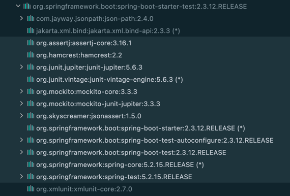

# 1. 시작

그동안 많이 사용했으면서도 왜 정리하지 않았을까 싶은 **@SpringBootTest** 에 대해 알아보고자 한다.
마침 [공식 문서](https://docs.spring.io/spring-boot/docs/current/reference/html/features.html#features.testing)
에서 궁금했던 부분을 설명해주고 있어 이번 기회에 정리해보았다.

# 2. spring-boot-starter-test 모듈

스프링 부트는 애플리케이션을 테스트하기 위한 다양한 기능들을 모듈을 통해 제공한다. 대표적인 모듈로
**spring-boot-starter-test**가 있고 대부분 이 모듈을 사용한다. **spring-boot-starter-test**에는 Spring Boot test 모듈,
JUnit Jupiter, AssertJ, Hamcrest, 그리고 Mockito 등의 라이브러리들이 포함되어 있다.

## 2.1. Supported Dependencies

spring-boot-starter-test가 지원하는 라이브러리들


* [JUnit 5](https://junit.org/junit5/): 자바 애플리케이션의 단위 테스트를 위한 사실상의 표준 프레임워크
* [Spring Test](https://docs.spring.io/spring-framework/docs/5.3.22/reference/html/testing.html#integration-testing)
  & Spring Boot Test: 스프링 부트 애플리케이션의 각종 유틸리티와 통합 테스트를 지원하는 라이브러리
* [AssertJ](https://assertj.github.io/doc/): assertion 라이브러리
* [Hamcrest](https://github.com/hamcrest/JavaHamcrest): Matchers 라이브러리
* [Mockito](https://site.mockito.org/): 자바 Mocking 프레임워크
* [JSONassert](https://github.com/skyscreamer/JSONassert): JSON용 assertion 라이브러리
* [JsonPath](https://github.com/json-path/JsonPath): JSON용 XPath

대부분 이들 기능을 사용해 테스트를 작성하고 경우에 따라 필요한 종속성을 추가해 테스트 한다.
JUnit 4를
사용하면 [junit-vintage-engine 의존성](https://docs.spring.io/spring-boot/docs/current/reference/html/features.html#features.testing)
을 추가하여 테스트를 실행할 수 있다.

# 3. @SpringBootTest

spring-boot-test 모듈에 포함된 기능 중에는 @SpringBootTest 어노테이션이 있다. **@SpringBootTest**은 스프링 부트 기반의
테스트를 실행할 때 많은 편의를 제공한다.

대표적으로 **@SpringBootTest**을 사용하면
* main 패키지에 정의된 기본 구성을 쉽게 사용할 수 있다. -> **TestConfiguration** 참고
* 기본 구성을 원치 않을 경우 테스트 구성을 별도로 지정할 수 있다. -> **TestConfiguration** 참고
* 테스트 환경에 필요한 스프링 빈을 전체 혹은 일부만 등록할 수 있다. -> **Classes** 참고
* 테스트 환경 프로퍼티를 추가 또는 재정의할 수 있다. -> **Properties** 참고
* 정의한 포트 또는 임의의 포트에서 원하는 환경으로 웹 서버를 실행할 수 있다. -> **WebEnvironment** 참고
* 애플리케이션 인수를 정의할 수 있다. -> **Args** 참고

주의할 점도 있다.
* JUnit 4 테스트는 @RunWith(SpringRunner.class)를 추가해야만 어노테이션이 작동한다. 그렇지 않으면 어노테이션이 무시된다.
* JUnit 5 테스트는 @ExtendWith(SpringExtension.class)이 이미 어노테이션에 포함되어 있기 때문에 따로 추가하지 않아도 된다.


## 3.1. TestConfiguration

**@SpringBootTest** 테스트는 특정 구성을 명시적으로 지정하지 않으면 기본 구성을 사용한다. 지정된 구성이 없을 때 검색 알고리즘이
@SpringBootApplication 또는 @SpringBootConfiguration이 달린 클래스를 찾고 이들로부터 기본 구성을 얻는다. 따라서 기본 구성을 얻기 위해
별도의 @ContextConfiguration 또는 중첩된 @Configuration을 사용하지 않아도 된다. (이는 **@xxxTest** 어노테이션 모두 마찬가지다.)

**@TestConfiguration**은 기본 구성을 **커스터마이징**할 때 사용한다. 주로 특정 빈을 추가하여 테스트 환경을 별도로 구성할 때 사용한다.
직접 정의한 테스트 구성을 테스트에 포함하는 방법은 크게 두 가지다.

### [1] @Import에 직접 @TestConfiguration 클래스 지정
```java
// @TestConfiguration이 달린 최상위 클래스에 구성된 빈은 컴포넌트 스캔 과정에서 선택되지 않는다. 
// 따라서 테스트 클래스에 @TestConfiguration 클래스를 명시적으로 등록해야 한다.
@TestConfiguration
public class MyTestConfiguration {

  @Bean
  DataSource createDataSource() {
    //
  }
}
```

```java
// 예시
@SpringBootTest
@Import(MyTestConfiguration.class) // @TestConfiguration 클래스를 직접 등록
public class MyTests {

  @Autowired
  DataSource datasource;

  @Test
  void exampleTest() {
    // ...
  }
}
```

### [2] static 중첩 클래스 사용

@TestConfiguration 또는 @Configuration이 달린 클래스가 테스트 클래스 내의 정적 중첩 클래스인 경우 구성이 자동 등록된다. 둘 사이에는 차이점이 있다.

* 중첩된 @Configuration 클래스의 경우 기본 구성을 "제외"하고 지정된 구성이 이를 "대신"한다.
* 중첩된 @TestConfiguration 클래스의 경우 기본 구성에 "추가"로 구성이 등록된다. ("재정의"도 가능)

```java

@SpringBootTest
public class MyTests {

  @Autowired
  DataSource datasource;

  //tests

  @TestConfiguration
  static class MyTestConfiguration {

    @Bean
    DataSource createDataSource() {
      //
    }
  }
}
```

@TestConfiguration의 가장 좋은 점은 해당 클래스의 구성이 **자동으로 애플리케이션의 기본 구성에 포함되지 않는다**는 점이다.
이들 구성은 @Import 어노테이션 또는 정적 중첩 클래스를 사용하여 요구사항이 있을 때만 반영할 수 있다.

한편, 스프링 테스트 프레임워크는 테스트 간에 애플리케이션 컨텍스트를 캐싱한다. 따라서 테스트 간 동일한 구성을 공유하고 있다면 컨텍스트가 로딩되는 프로세스는 한 번 실행된다.

하지만 일부 테스트에서 @MockBean, @SpyBean을 사용하면 컨텍스트가 오염되어 컨텍스트가 새로 생성되고, 새로 캐시된다.
이로 인해 성능저하가 심해질 수 있으므로 되도록 공통 컨텍스트를 최소한으로 유지하는 것이 좋다.

## 3.2. Classes

@SpringBootTest는 **classes** 속성을 사용하여 테스트 애플리케이션 컨텍스트에 등록할 빈 클래스들을 지정할 수 있다. classes 속성에
@Configuration 클래스가 있으면 지정한 Configuration 클래스 내부의 빈이 모두 등록된다. classes 속성을 지정하지 않으면
@SpringBootApplication이 감지하는 모든 빈이 등록된다. (엄밀히 말하면 @SpringBootApplication이 자동 감지하기 전에 중첩된
@Configuration을 먼저 찾는다.)

```java

@Configuration
public class MyTestConfiguration {

  @Bean
  DataSource createDataSource() {
    //
  }
}
```

```java

@SpringBootTest(
    classes = {
        MyTestService.class,
        MyTestConfiguration.class
    }
)
public class MyTests {

  @Autowired
  private MyTestService myTestService;

  @Autowired
  private DataSource dataSource; // MyTestConfiguration 에서 생성하는 빈
}
```

## 3.3. Properties

스프링 부트는 기본적으로 클래스 경로에 있는 `application.properties` 또는 `application.yml` 속성을 사용한다. 테스트 때만 특정 속성을 변경하려면
@SpringBootTest의 **properties** 속성을 사용하면 된다. **@SpringBootTest(properties = ...)** 에 지정된 속성은
테스트가 실행되기 전에 테스트 환경에 반영된다. 속성은 **{key=value}** 의 형태로 추가한다.

```java

@SpringBootTest(
    properties = {
        "app.example.property1=value1",
        "app.example.property2=value2",
    }
)
public class MyTests {
    ...
}
```

## 3.4. WebEnvironment

**@SpringBootTest**의 **webEnvironment** 속성으로 테스트 웹 환경을 구성할 수 있다. 설정 값에 따라 다양한 환경을 지원한다.

* **MOCK (default)**
    * WebApplicationContext을 로드하고 Mock 웹 환경을 제공한다. 임베디드(내장) 서버는 실행되지 않는다. classpath에서 웹
      환경을 사용할 수 없는 경우 웹이 아닌(non-web) 일반 ApplicationContext를 사용한다. MockMvc 기반 테스트에서
      @AutoConfigureMockMvc 또는 @AutoConfigureWebTestClient와 함께 사용할 수 있다.
* **RANDOM_PORT**: WebServerApplicationContext를 로드하고 실제 웹 환경을 제공한다. 내장 서버를 시작하고 임의의 포트에서 수신 대기한다.
* **DEFINED_PORT**: WebServerApplicationContext를 로드하고 실제 웹 환경을 제공한다. 내장 서버를 시작하고 (
  application.properties에서) 정의된 포트 또는 기본 포트 8080에서 수신 대기한다.
* **NONE**: SpringApplication을 사용하여 ApplicationContext를 로드하지만 (Mock 또는 기타) 웹 환경을 제공하지 않는다.

```java
// 예시
@SpringBootTest(webEnvironment = WebEnvironment.RANDOM_PORT)
class MyRandomPortWebTestClientTests {

  @Test
  void exampleTest() {
    // ...
  }
}
```

> 테스트가 @Transactional이면 기본적으로 각 테스트 메서드가 끝날 때 트랜잭션을 롤백한다. 그러나 RANDOM_PORT 또는 DEFINED_PORT와 함께 사용하면
> 실제 서블릿 환경을 제공하므로 HTTP 클라이언트와 서버가 별도의 스레드에서 실행되고, 이에 따라 별도의 트랜잭션이 발생한다. 이 경우 서버에서 시작된 트랜잭션은
> 롤백되지 않는다.

## 3.5. Args

애플리케이션에 인수가 필요한 경우 @SpringBootTest의 **args** 속성을 사용하여 인수를 제공할 수 있다.

```java

@SpringBootTest(args = "--app.test=one")
class MyApplicationArgumentTests {

  @Test
  void applicationArgumentsPopulated(@Autowired ApplicationArguments args) {
    assertThat(args.getOptionNames()).containsOnly("app.test");
    assertThat(args.getOptionValues("app.test")).containsOnly("one");
  }

}
```

# 4. 참고 자료

* [Spring Boot Docs - Core Features - Testing](https://docs.spring.io/spring-boot/docs/current/reference/html/features.html#features.testing)
* [Spring Boot Test](https://meetup.toast.com/posts/124)
* [Annotation Type SpringBootTest](https://docs.spring.io/spring-boot/docs/current/api/org/springframework/boot/test/context/SpringBootTest.html)
* [Spring boot – @TestConfiguration](https://howtodoinjava.com/spring-boot2/testing/springboot-test-configuration/)
* [권남 SpringBoot Test](https://kwonnam.pe.kr/wiki/springframework/springboot/test)
