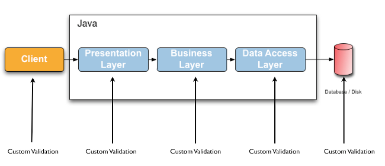
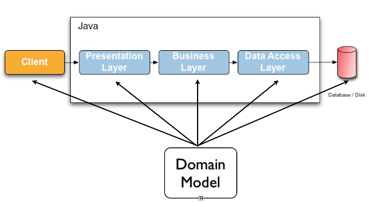

애플리케이션에서 **데이터 검증**은 프레젠테이션 계층부터 영속성 계층까지 거의 모든 계층에서 필요한 작업이다.
검증하는 코드를 계층별로 따로 만들 수 있지만 때론 비슷한 검증 코드를 여러 계층에 두는 것이 낭비적일 수 있다. (아래 그림 참고)



동일한 검증인데도 코드가 분산되면 유지보수 포인트가 늘어나는 단점이 있고, 메서드 내에 검증 로직이 있으면 비즈니스 로직에만 집중하기 어려운 단점도 있다.
결국, 이런 저런 이유를 종합했을 때 기본적이고, 공통적인 검증 로직은 한데 모아두고 사용하고 싶다는 생각이 드는데, **`Jakarta Bean Validation`**
과 **`Hibernate Validator`**는 이러한 갈증을 어느정도 해결해준다고 볼 수 있다.

# 1. Jakarta Bean Validation

Jakarta Bean Validation 3.0를 사용하면 개발자는 굳이 Custom Validation을 만들지 않아도 된다.
엔티티 또는 메서드 데이터 유효성 검사에 쓸 수 있는 기본적인 메타데이터 모델과 API를 이미 정의해두었기 때문이다.
기본적인 메타데이터 소스는 **어노테이션**으로 제공하고, 사용자가 이를 **재정의**하거나 **확장**할 수 있게 설계하였다.

또한 Jakarta Bean Validation에서 제공하는 API는 특정 애플리케이션 계층이나 프로그래밍 모델에 종속되지 않기 때문에 어느 계층이나 모델에서도 사용할 수 있다는
장점을 가진다.


Jakarta Bean Validation 명세를 구현하는 구현체로는 **`Hibernate Validator`**가 가장 널리 쓰인다.

# 2. Hibernate Validator 간단한 예제

**`Hibernate Validator`**를 사용하려면
아래 [종속성](https://mvnrepository.com/artifact/org.hibernate/hibernate-validator/7.0.5.Final)을 추가해주어야
한다. 이걸 추가하면 **`jakarta.validation:jakarta.validation-api:3.0.0`**도 함께 추가된다. <br>
(Jakarta Bean Validation API 종속성)

```gradle
implementation 'org.hibernate:hibernate-validator:7.0.5.Final'
```

또는 **`spring-boot-starter-validation`**을 대신 추가해도 좋다. 위 종속성이 모두 포함되어 있다.

```gradle
implementation 'org.springframework.boot:spring-boot-starter-validation'
```

## 2.1. Constraints 적용

간단한 **`Car`** 클래스를 만들고 멤버 필드에 제약 조건을 추가하자. <br>
여기에서는 **`@NotNull`**, **`@Size`** 그리고 **`@Min`**을 추가하였다.

```java
import javax.validation.constraints.Min;
import javax.validation.constraints.NotNull;
import javax.validation.constraints.Size;

public class Car {

  @NotNull
  private String manufacturer;

  @NotNull
  @Size(min = 2, max = 14)
  private String licensePlate;

  @Min(2)
  private int seatCount;

  public Car(String manufacturer, String licensePlate, int seatCount) {
    this.manufacturer = manufacturer;
    this.licensePlate = licensePlate;
    this.seatCount = seatCount;
  }

  // getters and setters
}
```

위 제약 조건으로 다음 내용을 검증한다.

* **manufacturer**는 `null`일 수 없다.
* **licensePlate**는 `null`이 아니며 `2 ~ 14`자 길이여야 한다.
* **seatCount**는 `2` 이상이어야 한다.

## 2.2. Constraints 테스트

**`javax.validation.Validator`** 인스턴스를 사용하면 위에서 설정한 제약 조건을 검증할 수 있다.

```java
import static org.assertj.core.api.Assertions.assertThat;

import java.util.Set;
import javax.validation.ConstraintViolation;
import javax.validation.Validation;
import javax.validation.Validator;

import org.junit.jupiter.api.Test;

class CarTest {

  private static final Validator VALIDATOR =
      Validation.buildDefaultValidatorFactory()
          .getValidator();

  @Test
  void manufacturerIsNull() {
    Car car = new Car(null, "KR-12-345", 5);

    Set<ConstraintViolation<Car>> constraintViolations = VALIDATOR.validate(car);

    assertThat(constraintViolations).hasSize(1);
    assertThat(constraintViolations.iterator().next().getMessage()).isEqualTo("널이어서는 안됩니다");
  }

  @Test
  void licensePlateTooShort() {
    Car car = new Car("Mark", "X", 5);

    Set<ConstraintViolation<Car>> constraintViolations = VALIDATOR.validate(car);

    assertThat(constraintViolations).hasSize(1);
    assertThat(constraintViolations.iterator().next().getMessage())
        .isEqualTo("크기가 2에서 14 사이여야 합니다");
  }

  @Test
  void seatCountTooLow() {
    Car car = new Car("Mark", "KR-12-345", 1);

    Set<ConstraintViolation<Car>> constraintViolations = VALIDATOR.validate(car);

    assertThat(constraintViolations).hasSize(1);
    assertThat(constraintViolations.iterator().next().getMessage())
        .isEqualTo("2 이상이어야 합니다");
  }

  @Test
  void carIsValid() {
    Car car = new Car("Mark", "KR-12-345", 2);

    Set<ConstraintViolation<Car>> constraintViolations = VALIDATOR.validate(car);

    assertThat(constraintViolations).hasSize(0);
  }
}
```

여기에 사용된 **`Validator`** 인스턴스는 스레드 안전하다. 그리고 여러 번 재사용할 수 있다. <br>
정적 필드로 선언해서 다른 Car 인스턴스의 유효성을 검사할 때 사용할 수 있다.

**`validate()`** 메서드는 **ConstraintViolation 인스턴스 집합**을 반환하는데, 요소 별로 어떤 유효성 검사에서 실패했는지 알 수 있다.
만약 유효성 검사에 통과하면 **`carIsValid()`** 테스트에서처럼 **빈 집합**을 반환한다.

갑작스러운 마무리지만, 테스트에서 **`jakarta.validation`** 패키지의 클래스만 사용했다는 것에 주목할 수 있다.
Bean Validation API에서 제공되는 명세만 사용하고, Hibernate Validator의 클래스를 직접 참조하지 않았기 때문에 다른 코드로도 이식이 가능하다는 특징이 있다.

# 3. 참고 자료

* [Hibernate Validator 7.0.5.Final - Jakarta Bean Validation Reference Implementation: Reference Guide](https://docs.jboss.org/hibernate/validator/7.0/reference/en-US/html_single/#preface)
* [hibernate-validator refereceguide](https://github.com/hibernate/hibernate-validator/tree/main/documentation/src/test/java/org/hibernate/validator/referenceguide)
