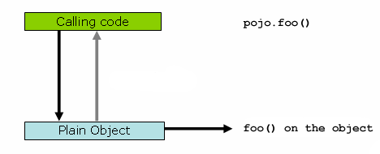
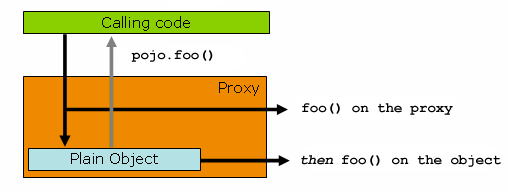

# 1. Proxing Mechanism

스프링 AOP는 **JDK 동적 프록시** 또는 **CGLIB**를 사용하여 주어진 **대상 객체(Target Object)** 에 대해 프록시를 생성한다. (선택할 수 있다면
JDK 동적 프록시가 선호된다).

대상 객체가 하나 이상의 인터페이스를 구현하면 JDK 동적 프록시가 사용된다. 이때 대상 유형(Target Type)에 의해 구현된 모든 인터페이스가 프록시된다. 대상 객체가
인터페이스를 구현하지 않으면 CGLIB 프록시가 생성된다.

CGLIB 프록시를 강제로 사용하는 경우(예: 인터페이스에 의해 구현된 메서드뿐만 아니라 대상 객체에 대해 정의된 모든 메서드를 프록시하기 위해) 그렇게 할 수 있다. 그러나 몇
가지 문제를 고려해야 한다.

* `final` 메서드는 재정의할 수 없으므로 조언할 수 없다. (cannot be advised).
* CGLIB 프록시는 클래스 경로에 CGLIB 2 바이너리가 필요하지만 동적 프록시는 JDK에서 사용할 수 있다. CGLIB을 사용하지만 CGLIB 라이브러리 클래스가 클래스
  경로에 없으면 스프링은 자동으로 경고를 보낸다.
* 프록시 객체의 생성자가 두 번 호출되고, 각각의 프록시 인스턴스마다 두 개의 객체가 생성된다. (실제 프록시된 객체와 어드바이스를 구현하는 하위 클래스의 인스턴스다). 이
  동작은 JDK 프록시를 사용할 때는 나타나지 않는다. 일반적으로 할당만 발생하고 생성자에서 실제 논리가 구현되지 않기 때문에 프록시 형식의 생성자를 두 번 호출하는 것은 문제가
  되지 않는다.

# 2. AOP 프록시 이해하기

스프링 AOP는 **프록시 기반**으로 작동한다. 프록시를 사용하는 경우와 사용하지 않은 경우를 비교하기 위해 먼저 프록시 처리되지 않은 코드를 살펴보자.

```java
public class SimplePojo implements Pojo {

  public void foo() {
    // 'this' 참조에 대해 메서드를 직접 호출한다.
    this.bar();
  }

  public void bar() {
    // some logic...
  }
}
```

객체 참조에서 메서드를 호출하면 아래에서 볼 수 있는 것처럼 해당 객체 참조의 메서드가 직접 호출된다.



```java
public class Main {

  public static void main(String[] args) {

    Pojo pojo = new SimplePojo();

    // 'pojo' 참조에 대해 메서드를 직접 호출한다.
    pojo.foo();
  }
}
```

한편, 클라이언트 코드에 있는 참조가 프록시인 경우 상황이 약간 다르다.


```java

public class Main {

  public static void main(String[] args) {

    ProxyFactory factory = new ProxyFactory(new SimplePojo());
    factory.addInterface(Pojo.class);
    factory.addAdvice(new RetryAdvice());

    Pojo pojo = (Pojo) factory.getProxy();

    // 이건 프록시에 대한 메서드 호출이다! 
    pojo.foo();
  }
}
```

여기서의 핵심은 Main 클래스의 `main(..)` 내부 클라이언트 코드에 **프록시 참조**가 있다는 것이다. 이는 객체 참조에 대한 메서드 호출이 프록시에 대한 호출이
되므로 **특정 메서드 호출과 관련된 모든 인터셉터(어드바이스)에 대상 객체 대신 프록시가 사용**될 수 있음을 의미한다. 그러나 호출이 최종적으로 대상 객체에 도달하면 프록시가
아닌 대상 객체(`this`)에 대해 메서드 호출이 일어난다. (여기에서는 SimplePojo 참조에 대해`this.bar()` 또는 `this.foo()` 호출이
이루어진다). 특히 위 코드에서 `bar()` 메서드는 `foo()`메서드 안에서 자체적으로 호출되는데 이 경우 프록시를 타지 않기 때문에 어드바이스가 적용되지 않는다.
(이결 self-invocation issue 라고 한다).

자체 호출에서도 해당 메서드와 관련된 어드바이스를 적용하려면 어떻게 해야 할까? 이 문제를 해결하는 가장 나은 방법은 기존 코드에 프록시 코드를 추가하는 것이다. (자체 호출이
되지 않도록 리팩터링하는 것이다).

```java
public class SimplePojo implements Pojo {

  public void foo() {
    ((Pojo) AopContext.currentProxy()).bar();
  }

  public void bar() {
    // some logic...
  }
}
```

```java
public class Main {

  public static void main(String[] args) {

    ProxyFactory factory = new ProxyFactory(new SimplePojo());
    factory.adddInterface(Pojo.class);
    factory.addAdvice(new RetryAdvice());
    factory.setExposeProxy(true); // 이 코드가 추가되었다.

    Pojo pojo = (Pojo) factory.getProxy();

    pojo.foo();
  }
}

```

> 참고로 AspectJ는 프록시 기반 AOP 프레임워크가 아니기 때문에 이러한 자체 호출 문제가 없다.

# 3. 참고 자료
* [Spring Docs - 7.6 Proxying mechanisms](https://docs.spring.io/spring-framework/docs/3.0.0.M4/reference/html/ch07s06.html#aop-understanding-aop-proxies)
* [Whiteship's Epril - 6.6. Proxying mechanisms](https://keesun.github.io/chapter%2006/2007/04/06/6-6-proxying-mechanisms.html)
