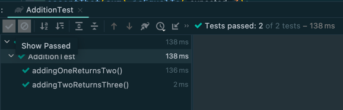

Junit 4와 5에서는 기본적으로 **각 테스트 메서드를 실행하기 전에 테스트 클래스의 인스턴스를 새로 생성**한다.
메서드마다 새로운 인스턴스의 상태를 가지기 때문에 테스트 간에는 상태를 공유할 수 없다.

그런데 때로는 서로 다른 테스트이지만, 테스트 간에 상태를 공유하고 싶을 수 있다.
예를 들어 사용해야 할 리소스가 무겁다거나 테스트 간의 관계가 복잡하게 얽혀있는 경우 상태를 공유하는 것으로 비용을 줄일 수 있다.

이를 위해 선행할 작업은 **인스턴스의 수명주기를 메서드 단위에서 클래스 단위로 변경**하는 것이다. 수명주기가 클래스 단위로 변경되면
메서드가 종료되어도 테스트 간에 상태를 공유할 수 있기 때문이다. 다행히 JUnit에서는 이 목적으로 **`@TestInstance`** 라는 어노테이션을 제공한다.
**`@TestInstance`**의 기본 설정과 변경 가능한 설정에 대해서는 아래서 살펴보기로 하자.

# 1. 기본적인 Test Lifecycle

Junit 4와 5에서는 기본적으로 **메서드 단위**의 테스트 클래스 수명주기를 제공한다.
따라서 테스트 클래스인 AdditionTest 인스턴스는 각 테스트 메서드가 호출되기 전에 새롭게 생성되고,
멤버 변수인 sum 역시 테스트마다 항상 1로 초기화된다.

```java
class AdditionTest {

  private int sum = 1;

  @Test
  void addingOneReturnsTwo() {
    sum += 1;
    assertThat(sum).isEqualTo(2);
  }

  @Test
  void addingTwoReturnsThree() {
    sum += 2;
    assertThat(sum).isEqualTo(3);
  }
}
```

테스트를 실행하면 테스트 간에는 인스턴스 상태를 공유하지 않기 때문에 아래와 같이 모두 통과하는 것을 볼 수 있다.



만약 테스트 클래스의 인스턴스가 서로 공유된다면 sum은 이전 테스트의 결과를 그대로 유지하기 때문에 나중에 실행되는 테스트가 실패하게 된다.


# 2. @BeforeClass 및 @BeforeAll

그렇다면 의도적으로 테스트끼리 동일한 인스턴스를 사용하게 하려면 어떻게 해야할까? 예를 들어 테스트 데이터로 대용량의 파일을 사용할 수 있다.
테스트를 실행할 때마다 파일을 읽어들이는 것은 비효율적이므로 전체 테스트에서 한 번만 파일을 읽어들이고 어딘가에 저장해서 사용하는 것이
좋을 것이다.

JUnit 4에서는 @BeforeClass을 제공하여 이 문제를 해결하였다.

```java
private static String largeContent;

@BeforeClass
public static void setUpFixture(){
    // read the file and store in 'largeContent'
    ...
    }
```

하지만 **`@BeforeClass`**를 사용하려면 위에서 알 수 있듯 변수와 메서드를 반드시 static으로 선언해야 했다.

JUnit 5에서는 **`@BeforeAll`** 어노테이션으로 JUnit 4의 `@BeforeClass`를 대체하였다.
그리고 **`@BeforeAll`**에 한 가지 기능을 추가했는데, 바로 테스트 클래스의 수명 주기가 클래스 단위일 경우
**인스턴스 메서드 또는 멤버 역시 사용할 수 있게 하였다.**

# 3. @TestInstance

`@BeforeAll`을 사용하든 `@BeforeClass`를 사용하든 상태를 공유하려면 결국, 테스트 클래스의 수명주기를 변경해야 한다.
그리고 JUnit 5에서는 테스트 클래스의 수명주기를 변경할 수 있도록 **`@TestInstance`**을 제공한다.
**`@TestInstance`**는 아래 두 가지 모드를 가지고 있다.

#### 1. `LifeCycle.PER_METHOD (default)`

* 테스트 클래스의 인스턴스가 각각의 **테스트 메서드, 테스트 팩터리 메서드, 테스트 템플릿 메서드마다 새롭게 생성된다.**

#### 2. `LifeCycle.PER_CLASS`

* 테스트 클래스의 인스턴스가 **전체 테스트에서 하나만 생성되고 테스트 간 공유된다.**

```java

@TestInstance(Lifecycle.PER_CLASS)
class LargeFileSerializerUnitTest {

  private String largeContent;

  @BeforeAll
  void setUpFixture() {
    // read the file
        ...
  }

}
```

앞서 언급했지만 **`@TestInstance(Lifecycle.PER_CLASS)`**와 **`@BeforeAll`**를 함께 사용하면
**변수나 함수를 static으로 선언하지 않아도 된다.**

# 4. @TestInstance(PER_CLASS) 사용시 고려해볼 부분

## 4.1. 값비싼 리소스

**`@TestInstance(Lifecycle.PER_CLASS)`**는 테스트 클래스를 인스턴스화하는 비용이 많이 들 때 유용하다. 예를 들어 데이터베이스 커넥션을 설정하거나
큰 파일을 로드하는 경우에 해당한다.

## 4.2. 순차적인 테스트

**일반적으로 유닛 테스트에서 상태 공유는 안티 패턴이다. 하지만 통합 테스트에서는 유용할 수 있다.**

상태를 공유하는 순차적인 테스트를 만들 때 **`@TestInstance(Lifecycle.PER_CLASS)`**를 사용하면 좋다.
예를 들어 특정 시스템을 구성하는 테스트를 앞단에 배치하고 전체 테스트를 실행하면, 이후의 테스트에서는 같은 구성 작업을 반복하지 않아도 된다.

JUnit 5는 **`@TestMethodOrder`** 어노테이션으로 순차적인 테스트를 지원한다.
테스트 메서드에 **`@Order`**를 붙이거나 [다른 방법](https://www.baeldung.com/junit-5-test-order)을 사용하여 테스트 실행
순서를 지정할 수 있다.

```java

@TestMethodOrder(OrderAnnotation.class)
@TestInstance(Lifecycle.PER_CLASS)
class OrderUnitTest {

  private int sum;

  @BeforeAll
  void init() {
    sum = 1;
  }

  @Test
  @Order(1)
  void firstTest() {
    sum += 2;
    assertEquals(3, sum);
  }

  @Test
  @Order(2)
  void secondTest() {
    sum += 3;
    assertEquals(6, sum);
  }
}
```

## 4.3. 일부 상태 공유

기본적으로 테스트 수명주기를 클래스 단위로 유지하더라도 **특정 상태는 테스트 간에 공유하고 싶지 않을 수 있다**.
테스트 별로 상태를 초기화해야하거나 일부 데이터를 지우고 싶은 경우라면 JUnit 5에서 제공하는 **`@BeforeEach`** 또는 **`@AfterEach`**을 사용하자. 
테스트 메서드 위에 어노테이션을 붙이면 테스트와 테스트 사이에 정리해야 하는 작업을 수행할 수 있다.

# 5. 참고 자료

* [@TestInstance Annotation in JUnit 5](https://www.baeldung.com/junit-testinstance-annotation)
