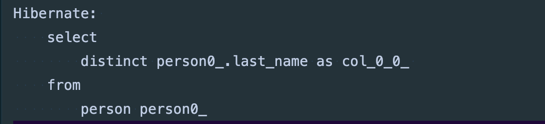
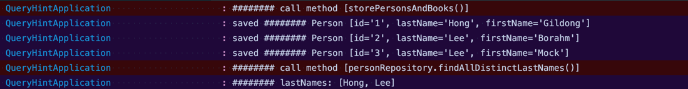
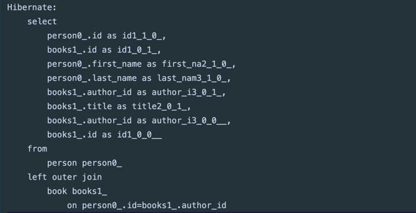
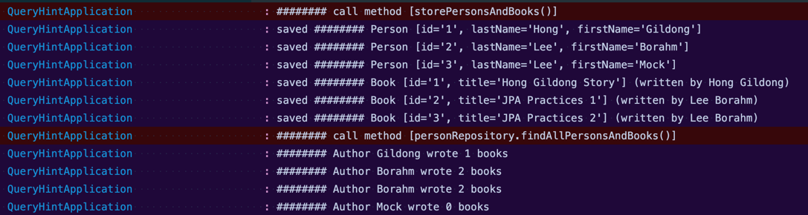
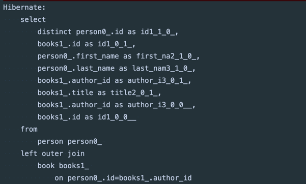
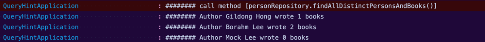
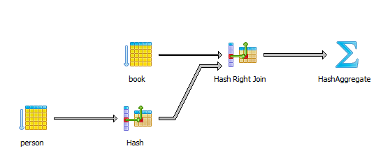
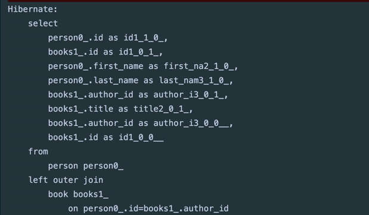
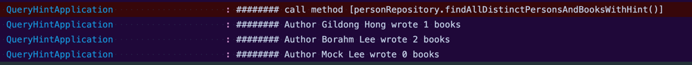
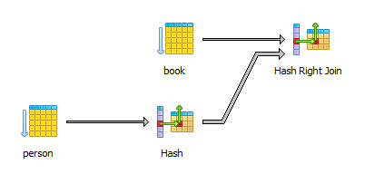

# 1. 들어가며

그동안 JPQL로 DB에 있는 데이터를 조회할 때 중복된 엔티티를 제거하기 위해 **`distinct`** 키워드를 많이 사용해왔다.
부모 A와 그와 연관된 자식 a, b를 함께 조회할 때 동일한 식별자를 가진 부모 A의 중복을 제거하기 위해 말이다.

어느 날 이와 관련한 PR을 봐주던 한 팀원이 **distinct를 사용한 이유**에 대해 물어보았다.
나는 크게 고민하지 않고 (위에 얘기한 것처럼) 엔티티 중복을 피하기 위해 사용했다고 답했다. (이때까지만 해도
distinct 사용이 **사이드 이펙트**를 야기할 수 있다고 생각해보지 못했다). 대답을 마치자 팀원은 다른 이야기를 건네주었다.
내용은 아래와 같은데 이전에 미처 생각해보지 못한 내용이었다.

> "**sql 쿼리에까지 distinct 를 전달하는 것이 정말 필요한 것인지** 생각해봐야 할 것 같다."
> <br><br>
> "**hibernate.query.passDistinctThrough** 에 대해서도 찾아보면 좋겠다."

이 말을 듣고 궁금증이 생겨 **JPQL에서 distinct를 사용할 때 주의할 점**에 대해 바로 찾아보았다.
그리고
곧 [Vlad Mihalcea 선생님의 글](https://in.relation.to/2016/08/04/introducing-distinct-pass-through-query-hint/)
을 읽으며
팀원이 해준 말의 숨은 뜻을 이해하였다.

이하
문서에서는 [Vlad Mihalcea 선생님의 글](https://in.relation.to/2016/08/04/introducing-distinct-pass-through-query-hint/)
을 정리하였다.
실제로 수행한 코드와 이미지를 첨부하였기 때문에 나중에 다시 읽어봐도 도움이 될 것 같다. 참고로 원문 자체가 매우 직관적으로 내용을 잘 설명하기 때문에 이 글을 읽은 후 
(혹은 읽기 전에) 꼭 읽어보길 추천한다.

# 2. 도메인 모델

이후에 진행할 테스트에서는 **`Person`** 과 **`Book`** 두 개의 도메인 모델을 사용한다.
한 명의 Person(책 입장에서 저자)는 여러 권의 책을 쓸 수 있으므로 둘은 1:N 의 연관관계를 가진다고 가정한다.
코드를 간단히 하기 위해 lombok 을 사용하였다.

## 2.1. Person

```java

@Entity
@Getter
@Setter
@Table(name = "person")
public class Person {

  @Id
  @GeneratedValue(strategy = GenerationType.IDENTITY)
  private Long id;

  @Column(name = "first_name")
  private String firstName;

  @Column(name = "last_name")
  private String lastName;

  @OneToMany(mappedBy = "author", cascade = CascadeType.ALL)
  private List<Book> books = new ArrayList<>();

  protected Person() {
  }

  public Person(String firstName, String lastName) {
    this.firstName = firstName;
    this.lastName = lastName;
  }

  public void addBooks(List<Book> books) {
    this.books.addAll(books);
    this.books.forEach(b -> b.setAuthor(this));
  }

  @Override
  public String toString() {
    return String.format(
        "Person [id='%d', lastName='%s', firstName='%s']",
        id, lastName, firstName
    );
  }
}

```

## 2.2. Book

```java

@Getter
@Setter
@Entity
@ToString
@Table(name = "book")
public class Book {

  @Id
  @GeneratedValue(strategy = GenerationType.IDENTITY)
  private Long id;

  private String title;

  @ManyToOne
  @ToString.Exclude
  private Person author;

  public Book() {
  }

  public Book(String title) {
    this.title = title;
  }

  @Override
  public String toString() {
    return String.format(
        "Book [id='%d', title='%s']",
        id, title
    );
  }
}
```

# 3. DISTINCT 사용

## 3.1. findAllDistinctLastNames()

다음은 **`distinct`** 를 **적절히** 사용한 예시다.

저자 목록에서 **특정 저자**를 찾으려는 요구사항이 있다고 하자. <br>
검색을 쉽게 하려면 저자들의 **성(lastName) 목록**을 먼저 제공해주면 된다.

아래와 같이 **`distinct`** 키워드를 사용하면 저자들의 **고유한 성(lastName) 목록**을 불러올 수 있다.

```java
  @Query("select distinct p.lastName from Person p")
  List<String> findAllDistinctLastNames();
```

위 메서드를 호출하면 Hibernate가 SQL 쿼리를 만들어주고


아래와 같이 중복을 제거한 결과를 반환한다. 이런 상황에서 **`distinct`**를 사용하는 것은 매우 바람직하다.


다음 경우는 어떨까?

## 3.2. findAllPersonsAndBooks()

이번에는 특정 저자와 그가 작성한 책 정보를 함께 알고 싶다.
그래서 **`Person`** 뿐만 아니라 **`Book`** 엔티티들도 함께 조회하려 한다. (join fetch 사용)

```java
  @Query(
    "select p from Person p " +
        "left join fetch p.books "
)
  List<Person> findAllDistinctPersonsAndBooks();

```

위 쿼리를 실행하면 역시 Hibernate가 SQL 쿼리를 만들어주고


불러온 결과를 반환한다. 반환된 결과는 반복문을 돌려 로그로 출력하였다.


로그 하단을 보면 저자가 총 4번 출력되고, Borahm이 **중복되었다**는 것을 알 수 있다. 이는 fetch 결과를 담는 ResultSet 에 4개의
레코드가 저장되어 있기 때문인데, 레코드의 개수가 조회한 저자와 연관된 책의 수로 지정되어 있기 때문이다.

## 3.3. findAllDistinctPersonsAndBooks()

위와 같은 상황에서 **중복된 엔티티를 제거**하려면 **`distinct`** 키워드를 사용하면 된다.

```java
  @Query(
    "select distinct p from Person p " +
        "left join fetch p.books "
)
  List<Person> findAllDistinctPersonsAndBooks();
```

실행하면 아까와 달리 SQL 쿼리에 **`distinct`** 가 포함되고


더 이상 **엔티티 중복이 발생하지 않는다.** 이는 JDBC에서 ResultSet 을 가져온 후 엔티티 그래프를 빌드할 때 **Hibernate가 중복을 제거**하기 때문이다.


# 4. DISTINCT 사용 문제

그런데 조금 전 상황에서 생각해볼 것이 하나 있다.

JDBC로부터 페치해서 ResultSet 에 데이터를 담는 상황을 생각해보자.
사실 위와 같은 경우 JDBC ResultSet 에는 (저자, 책)의 조합으로 중복된 항목이 없기 때문에 **`distinct`**을 사용해서 얻는 이점이 없다.
뿐만 아니라 쿼리 실행기로 **ResultSet을 정렬해야 하기 때문에 오히려 성능이 저하**되는 문제가 있다.

예를 들어 PostgreSQL에서 이전 쿼리를 실행하면 아래 실행 계획(execution plan)이 생성된다.



`HashAggregate` 단계는 결과 집합을 정렬하고 중복 항목이 없는지 확인하는 작업과 연관되어 있다.
(HashAggregate의 작동 방식을 알고
싶다면 [이곳](https://www.depesz.com/2013/05/19/explaining-the-unexplainable-part-4/)을 참고하자).
기본적으로 결과 집합은 중복된 행이 차례대로 정렬되는 특징을 이용해 이전 레코드와 동일한 경우 행을 버리도록 작동한다.

MySQL에서 동일한 쿼리로 EXPLAIN FORMAT=JSON을 실행하면 아래 실행 계획을 얻는다.

```json
{
  "query_block": {
    "select_id": 1,
    "cost_info": {
      "query_cost": "5.02"
    },
    "duplicates_removal": {
      "using_temporary_table": true,
      "using_filesort": false,
      "nested_loop": [
        {
          "table": {
            "table_name": "p",
            "access_type": "ALL",
            "rows_examined_per_scan": 3,
            "rows_produced_per_join": 3,
            "filtered": "100.00",
            "cost_info": {
              "read_cost": "1.00",
              "eval_cost": "0.60",
              "prefix_cost": "1.60",
              "data_read_per_join": "4K"
            },
            "used_columns": [
              "id",
              "first_name",
              "last_name"
            ]
          }
        },
        {
          "table": {
            "table_name": "b",
            "access_type": "ALL",
            "possible_keys": [
              "FKi7lkcmacourlqkkn4uo1s4svl"
            ],
            "rows_examined_per_scan": 4,
            "rows_produced_per_join": 12,
            "filtered": "100.00",
            "using_join_buffer": "Block Nested Loop",
            "cost_info": {
              "read_cost": "1.02",
              "eval_cost": "2.40",
              "prefix_cost": "5.02",
              "data_read_per_join": "9K"
            },
            "used_columns": [
              "id",
              "title",
              "author_id"
            ]
          }
        }
      ]
    }
  }
}
```

**`distinct`** 키워드가 있을 때 MySQL은 중복된 항목을 찾기 위해 정렬 알고리즘을 수행하는데, 이때 중간 결과 집합을 저장할 목적으로 임시 테이블을 사용한다.
그래서 **`duplicates_removal`** 속성과 **`using_temporary_table`** 속성이 함께 명시되었다.

어떻게 사용하든 결국 **`distinct`**는 비용이 드는 키워드이다. 
따라서 이 키워드는 본래 목적에 맞게 **명령문 결과 집합에서 중복된 레코드를 필터링해야 하는 경우**에만 사용해야 한다. (3.1. findAllDistinctLastNames() 참고)

# 5. 문제 해결: passDistinctThrough

그러나 애플리케이션 상에서 중복된 엔티티를 사용할 수는 없으므로 **`distinct`** 키워드를 포기할 순 없다.
이 키워드를 사용하되, MySQL SQL 쿼리에는 전달하지 않고 JPA Hibernate에서만 사용할 방법이 필요하다.

JPA 레벨의 Query Hint인 **`hibernate.query.passDistinctThrough`** 은 이 문제를 깔끔히 해결한다.
다음 코드를 보자.

```java
  @Query(
    "select distinct p from Person p " +
        "left join fetch p.books "
  )
  @QueryHints(@QueryHint(name = org.hibernate.jpa.QueryHints.HINT_PASS_DISTINCT_THROUGH, value = "false"))
  List<Person> findAllDistinctPersonsAndBooksWithHint();
```

**`hibernate.query.passDistinctThrough`** 힌트는 실제 SQL 쿼리에 **`distinct`**를 전달하지 않도록 Hibernate에 지시한다.
한다. 아래 쿼리에서도 **`distinct`**가 사라진 것을 볼 수 있다.



하지만 로그를 보면 이전처럼 **중복된 엔티티가 제거되어** 출력된 것을 볼 수 있다.


PostgreSQL로 비교하면 쿼리 계획은 아래와 같이 변경되었다.


데이터베이스는 더 이상 `HashAggregate` 단계를 가지지 않고, 중복 발견을 위한 결과 집합 정렬을 수행하지 않는다.

MySQL 쿼리 계획도 아래와 같이 변경되었다.

```json
{
  "query_block": {
    "select_id": 1,
    "cost_info": {
      "query_cost": "5.02"
    },
    "nested_loop": [
      {
        "table": {
          "table_name": "p",
          "access_type": "ALL",
          "rows_examined_per_scan": 3,
          "rows_produced_per_join": 3,
          "filtered": "100.00",
          "cost_info": {
            "read_cost": "1.00",
            "eval_cost": "0.60",
            "prefix_cost": "1.60",
            "data_read_per_join": "4K"
          },
          "used_columns": [
            "id",
            "first_name",
            "last_name"
          ]
        }
      },
      {
        "table": {
          "table_name": "b",
          "access_type": "ALL",
          "possible_keys": [
            "FKi7lkcmacourlqkkn4uo1s4svl"
          ],
          "rows_examined_per_scan": 4,
          "rows_produced_per_join": 12,
          "filtered": "100.00",
          "using_join_buffer": "Block Nested Loop",
          "cost_info": {
            "read_cost": "1.02",
            "eval_cost": "2.40",
            "prefix_cost": "5.02",
            "data_read_per_join": "9K"
          },
          "used_columns": [
            "id",
            "title",
            "author_id"
          ],
          "attached_condition": "<if>(is_not_null_compl(b), (`hibernate_orm_test`.`b`.`author_id` = `hibernate_orm_test`.`p`.`id`), true)"
        }
      }
    ]
  }
}
```

보다시피 더 이상 **`duplicates_removal`** 속성과 **`using_temporary_table`** 속성이 존재하지 않는다.

마지막으로 수정된 내용은 Hibernate 5.2.2부터 사용할 수 있으므로 버전이 낮다면 업그레이드하는 것을 추천한다.

# 6. 참고 자료

* [The DISTINCT pass-through Hibernate Query Hint](https://in.relation.to/2016/08/04/introducing-distinct-pass-through-query-hint/)
* [The best way to use the JPQL DISTINCT keyword with JPA and Hibernate](https://vladmihalcea.com/jpql-distinct-jpa-hibernate/)
