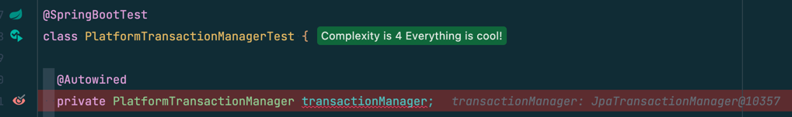
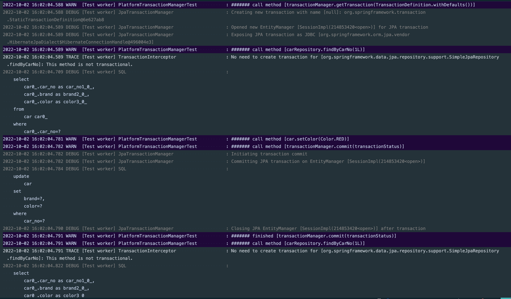
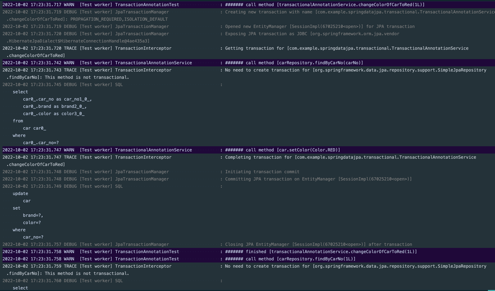
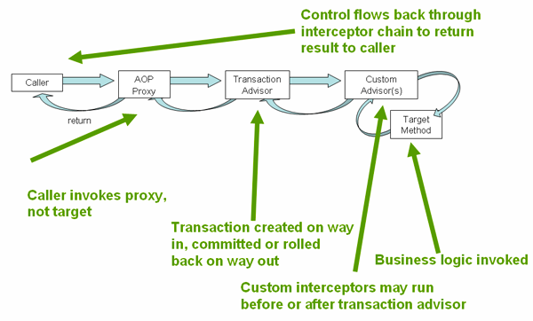

스프링에서 많이 사용하는 **@Transactional**에 대해 알아본다. 사실 한두 가지로 끝날 내용이 아니기 때문에 이번 문서에서 다 다루지는 못한다.
최대한 정리하는 대로 그때 그때 문서를 남기려 한다.

# 1. PlatformTransactionManager

스프링은 **PlatformTransactionManager**라는 인터페이스를 **추상화**하고 여기에 **트랜잭션 관리**에 필요한 메서드들을 정의해두었다.
예를 들어 트랜잭션 전략에 따라 새로운 트랜잭션을 얻는 기능, 커밋 또는 롤백을 수행하는 기능이 여기에 포함된다.

**PlatformTransactionManager**는 껍데기로 존재할 뿐이고, 껍데기의 구현체는 사용하는 기술에 따라 다르다.
예를 들어 JDBC를 사용하면 **DataSourceTransactionManager**, Hibernate를 사용하면
**HibernateTransactionManager**, Jpa를 사용하면 **JpaTransactionManager**가 PlatformTransactionManager의
구현체가
된다.

```java
// 트랜잭션 매니저 껍데기인 PlatformTransactionManager 인터페이스
public interface PlatformTransactionManager extends TransactionManager {

  TransactionStatus getTransaction(TransactionDefinition definition) throws TransactionException;

  void commit(TransactionStatus status) throws TransactionException;

  void rollback(TransactionStatus status) throws TransactionException;
}
```

## 1.1. 테스트

PlatformTransactionManager의 메서드를 사용하여 간단한 테스트를 만들었다.
PlatformTransactionManager의 구현체는 스프링으로부터 **JpaTransactionManger**를 주입받아 사용하였다.


### 테스트 코드

```java

@SpringBootTest
class PlatformTransactionManagerTest {

  @Autowired
  private PlatformTransactionManager transactionManager; // JpaTransactionManger

  @Autowired
  private CarRepository carRepository;

  @BeforeEach
  void setUp() {
    Car car = new Car(1L, CarBrand.TESLA, Color.BLUE); // carNo, brand, color
    carRepository.save(car);
  }

  @Test
  void testPlatformTransactionManager() {
    TransactionStatus transactionStatus =
        transactionManager.getTransaction(TransactionDefinition.withDefaults());

    try {
      Car car = carRepository.findByCarNo(1L);
      assertThat(car.getColor()).isEqualTo(Color.BLUE);

      car.setColor(Color.RED);

      transactionManager.commit(transactionStatus);
    } catch (Exception e) {
      transactionManager.rollback(transactionStatus);
      throw e;
    }

    Car foundCar = carRepository.findByCarNo(1L);
    assertThat(foundCar.getColor()).isEqualTo(Color.RED);
  }
}
```

## 1.2. 실행 결과

실행 후 로그를 보면 트랜잭션 매니저가 어떻게 트랜잭션을 관리하는지 알 수 있다.

* 먼저 트랜잭션 매니저의 **`getTransaction()`**을 호출할 때 **새로운 트랜잭션**이 생성되고, **새로운 엔티티 매니저와 세션**이 열린다.
* JPA 트랜잭션은 이제 JDBC로 인지된 상태가 된다.
* 조회한 차의 색상을 트랜잭션 안에서 변경하고, **`commit()`** 을 호출할 때 **트랜잭션 커밋**이 시작되었다.
트랜잭션 커밋 중에는 엔티티 매니저에서 데이터베이스로 SQL 쿼리가 전달되었고, 커밋이 끝나자 엔티티 매니저와 세션이 종료되었다.  


트랜잭션 매니저라는 존재가 이렇게 쉽게 트랜잭션을 관리해주는 것은 고마운 일이다. 하지만 매번 이렇게 코드를 작성하는 일은 효율적이지 않다.

위의 코드는 비즈니스 로직과 트랜잭션 관리 코드가 공존하고 있다. 이렇게 되면 시간이 지날수록 복잡해지는 비즈니스 로직 때문에 코드 관리가 힘들어진다.
또한 서비스의 책임을 분리하지 못하는 문제도 남게 된다.

스프링에서는 이 문제를 해결할 수 있도록 **`@Transactional`**이라는 어노테이션을 제공한다.
프로그래밍적으로 트랜잭션을 관리하는 PlatformTransactionManager과 달리
**`@Transactional`**을 선언할 때는 **선언적 트랜잭션 관리**라는 표현을 쓴다.

# 2. @Transactional

**@Transactional** 어노테이션을 사용하면 이전처럼 트랜잭션을 얻거나, 커밋 또는 롤백하는 코드를 직접 작성하지 않아도 된다.

아래에서는 **@Transactional**을 사용할 때 코드가 어떻게 달라지는 살펴볼 것이다.
보통 **@Transactional** 어노테이션은 서비스 내에 위치시키므로 임의의 서비스 코드를 추가하였다.

## 2.1. 테스트 코드

```java

@SpringBootTest
class TransactionAnnotationTest {

  @Autowired
  private CarRepository carRepository;

  @Autowired
  private TransactionalAnnotationService transactionalAnnotationService;

  @BeforeEach
  void setUp() {
    Car car = new Car(1L, CarBrand.TESLA, Color.BLUE); // carNo, brand, color
    carRepository.save(car);
  }

  @Test
  void testTransactionalAnnotation() {
    Car car = carRepository.findByCarNo(1L);
    assertThat(car.getColor()).isEqualTo(Color.BLUE);

    transactionalAnnotationService.changeColorOfCarToRed(1L);

    Car foundCar = carRepository.findByCarNo(1L);
    assertThat(foundCar.getColor()).isEqualTo(Color.RED);
  }
}

```

## 2.2. 서비스 코드

```java
@Service
@RequiredArgsConstructor
public class TransactionalAnnotationService {
  
  private final CarRepository carRepository;

  @Transactional
  public void changeColorOfCarToRed(long carNo) {
    Car car = carRepository.findByCarNo(carNo);

    car.setColor(Color.RED);
  }
}
```

보다시피 서비스 코드나 테스트 코드 어디에도 트랜잭션 관리를 위한 코드는 존재하지 않는다. 
다른 부가적인 기능도 훌륭하지만 핵심 비즈니스 로직에만 집중할 수 있도록 도와주는 것이 **@Transactional** 사용의 큰 장점인 것 같다.

## 2.3. 실행 결과

다음으로 로그를 보자.
**@Transactional**을 선언한 메서드 **`changeColorOfCarToRed()`**를 호출할 때 트랜잭션이 생성되었다. 
그리고 이전에 보지 못했던 **TransactionInterceptor**가 등장해 트랜잭션을 얻었다는 로그가 나오는데 이 부분은 나중에 살펴볼 것이다.

이후 **`changeColorOfCarToRed()`** 메서드 로직대로 차를 조회하고 색상을 변경하는 작업이 진행되었다.
메서드가 완전히 종료되기 전에 **TransactionInterceptor**가 한 번 더 등장하였고 트랜잭션을 완료한다는 메시지를 남겼다.
트랜잭션을 완료한다는 메시지가 남았으나, 트랜잭션 커밋은 그 이후 JpaTransactionManager에 의해 수행되었다.




**@Transactional**을 사용하면 서비스에 핵짐 비즈니스 로직만 작성해도
트랜잭션이 알아서 관리된다는 점이 가장 강력한 장점인 것 같다.

## 2.1. @Transactional 작동 원리

그렇다면 대체 어떻게 **@Transactional** 하나만으로 트랜잭션이 관리되는 것일까?
결론부터 말하면 **@Transactional**은 나 대신 누군가를 앞세워 트랜잭션을 관리한다. 스프링에서는 동작을 **대신** 제어/수행하는 객체를 **AOP
Proxy**라고 부르는데, **@Transactional**을 사용하면 **AOP Proxy**가 생성되어 트랜잭션을 알아서 관리한다.
> AOP Proxy에 대한 내용은 여기 [문서](https://bky373.github.io/2022-09-07-annotation-transactional/)를 참고하자.

## 2.2. 트랜잭션 AOP Proxy 동작


> [이미지 출처](https://docs.spring.io/spring-framework/docs/3.0.0.M4/reference/html/ch10s05.html)

## 2.3. @Transactional 사용시 주의할 점

# References

* [Spring Docs - 1.2. Understanding the Spring Framework Transaction Abstraction
  ](https://docs.spring.io/spring-framework/docs/current/reference/html/data-access.html#transaction-declarative-annotations)
* [Spring Docs - 10.5.1 Understanding the Spring Framework's declarative transaction implementation
  ](https://docs.spring.io/spring-framework/docs/3.0.0.M4/reference/html/ch10s05.html)
* [[Spring] Transaction 사용 방법](https://steady-coding.tistory.com/610)
