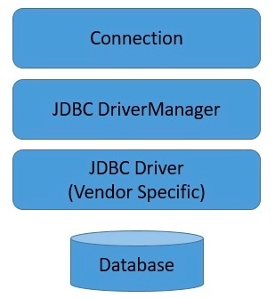
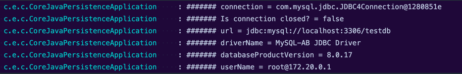
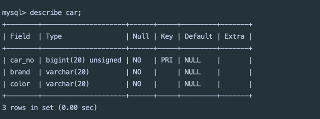
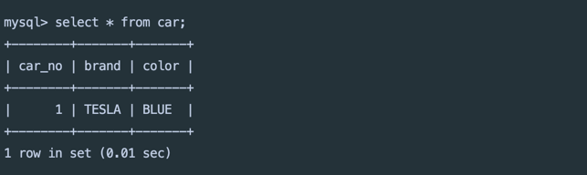
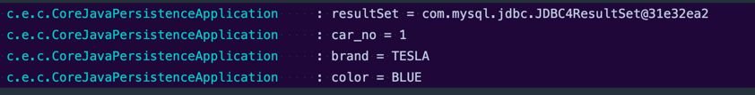
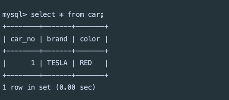
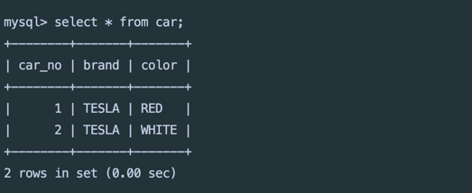
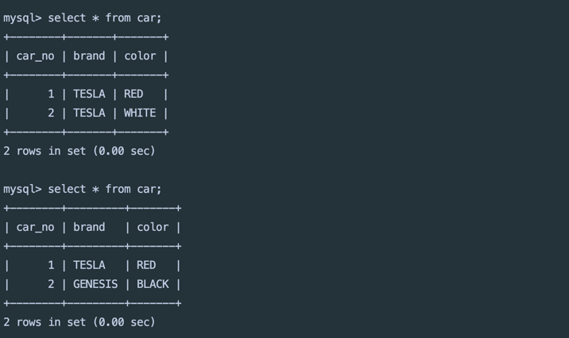

# 1. JDBC 구성요소

JDBC(Java Database Connectivity)는 아래 네 가지 구성요소를 가지고 있다.

### 1.1. JDBC API

* 아래 [JDBC API 섹션](http://localhost:4000/2022-10-03-introduction-to-jdbc/#2-jdbc-api) 참고
* (참고) JDBC 4.0 API는 java.sql 및 javax.sql 두 패키지로 나뉘어 있다.

### 1.2. JDBC Driver Manager

* JDBC DriverManager 클래스는 **Java 애플리케이션을 JDBC driver에 연결**할 수 있는 객체를 정의한다. 전통적으로 JDBC 아키텍처에서 중추적인
  역할을 맡는다.
* 표준 확장 패키지 javax.naming과 javax.sql을 사용하면 **DataSource 객체를 이용해** 데이터소스와의 **커넥션을 설정**할 수 있다. <br>
  

### 1.3. JDBC Test Suite

* JDBC driver 테스트 모음은 **JDBC driver가 사용자의 프로그램을 실행할지 말지**를 결정하는 데 도움이 된다. 테스트가 모든 케이스를 커버하진 못하지만
  JDBC API의 중요한 많은 기능을 실행한다.

### 1.4. JDBC-ODBC Bridge

* Java Software 브리지는 ODBC(Open Database Connectivity) 드라이버를 통해 JDBC 액세스를 제공한다. ODBC 드라이버를 사용하려면
  클라이언트 시스템에 ODBC 바이너리 코드를 로드해주어야 한다.

# 2. JDBC API

**JDBC API**는 모든 종류의 **테이블 형식** 데이터, 특히 **관계형 데이터베이스에 저장된 데이터에 접근할 수 있는 Java API**를 말한다.
분산된 환경에서 여러 데이터 소스와 상호 작용할 수 있다. 대표적으로 아래 기능을 지원한다.

1. 데이터베이스와 같은 **데이터 소스에 연결**
2. 데이터베이스에 **SQL 쿼리 또는 업데이트 문 전달**
3. 데이터베이스에서 쿼리 응답으로 받은 **결과 검색 및 처리**

> The JDBC API is a Java API that can access any kind of tabular data, especially data stored in a
> relational database.

아래는 위 기능을 사용한 간단한 예시다.

```java
public void connectToAndQueryDatabase(String username,String password){

    Connection con=DriverManager.getConnection(
        "jdbc:myDriver:myDatabase",
        username,
        password
    );

    Statement stmt=con.createStatement();
    ResultSet rs=stmt.executeQuery("SELECT a, b, c FROM Table1");

    while(rs.next()){
        int x=rs.getInt("a");
        String s=rs.getString("b");
        float f=rs.getFloat("c");
    }
}
```

위 코드를 순서대로 살펴보면, 먼저 **DriverManager** 객체를 DB 드라이버에 연결하고 데이터베이스에 로그인한다.
**Statement** 객체를 인스턴스화하고 사용자의 SQL 쿼리를 데이터베이스에 전달하기 위해 쿼리 메서드를 실행한다. 이후 **ResultSet** 객체를 인스턴스로 만들어
쿼리 결과를 담고, while 루프를 실행하여 검색한 결과를 출력한다.

# 3. JDBC Driver

**JDBC 드라이버**는 특정 데이터베이스를 연결하는 데 사용되는 **JDBC API의 구현체**이다.
대표적으로 MySQL에 사용되는 [Connector/J](https://github.com/mysql/mysql-connector-j)가 있다.

[Type 1 부터 Type 4](https://docs.oracle.com/javase/tutorial/jdbc/basics/gettingstarted.html)까지 여러가지
유형이 있지만,
JDBC 호출을 데이터베이스별 호출로 변환하여 **직접 데이터베이스에 연결하는 Type 4**가 가장 많이 사용된다. (Connector/J도 Type 4이다).
Type 4는 직접 연결을 시도하기 때문에 다른 유형에 비해 성능이 더 좋고 플랫폼에 독립적이라는 장점이 있다. 하지만 특정 데이터베이스 프로토콜에 종속적이라는 단점을 가진다.

**`(중요)`** **데이터베이스에 연결하려면 사용자는 반드시 JDBC 드라이버 객체를 얻어야 한다.**
DriverManager에 아래와 같은 JDBC URL connection 문자열을 제공하면 드라이버 객체를 얻을 수 있다.

```
// JDBC URL connection 문자열 예시
 
jdbc:mysql://localhost:3306/myDb?user=user1&password=pass
```

보통 URL에는 **데이터베이스 엔진 유형, 데이터베이스 이름, 호스트 이름 및 포트**가 포함되고, 데이터베이스 공급업체 별로 사용 가능한 **connection 매개변수**가
포함된다.

## 3.1. DriverManager

아래와 같이 **DriverManager.getConnection() 메서드**에 JDBC URL connection 문자열을 전달하면 내부적으로 classpath에 있는
드라이브 목록을 로드한 후 현재 주어진 URL에 알맞은 드라이버와 커넥션을 얻을 수 있다.

```java
Connection con=DriverManager.getConnection(
    "jdbc:postgresql://localhost:21500/test?user=fred&password=secret&ssl=true"
);
```

### java.sql.DriverManager 클래스

```java 
private static Connection getConnection(String url, java.util.Properties info, Class<?> caller) throws SQLException {
    ...

    // System 속성을 확인하여 초기 JDBC 드라이버 목록을 로드하고
    // 로드를 마치면 "JDBC DriverManager initialized" 메시지를 출력한다.
    ensureDriversInitialized();

    ...

    for (DriverInfo aDriver : registeredDrivers) {
      if (isDriverAllowed(aDriver.driver, callerCL)) {
        try {
            println("    trying " + aDriver.driver.getClass().getName());
            Connection con = aDriver.driver.connect(url, info);
            if (con != null) {
                // Success!
                println("getConnection returning " + aDriver.driver.getClass().getName());
                return (con);
            }
        } catch (SQLException ex) {
            if (reason == null) {
              reason = ex;
            }
        }

      } else {
        println("    skipping: " + aDriver.getClass().getName());
      }
    }
    
    ...
}
```

## 3.2. Connection

**DriverManager.getConnection() 메서드**에서 드라이버와 데이터베이스 연결이 성공하면 **Connection** 인스턴스를 얻을 수 있다.
**Connection**은 JDBC에서 특정 데이터베이스와의 기본 통신 단위이며 SQL 문이 실행되고 해당 컨텍스트 안에서 실행된 결과를 반환받을 수 있다.
**getMetaData() 메서드**를 호출하면 현재 연결된 데이터베이스의 테이블, 지원되는 SQL 문법, 저장된 프로시저 등을 얻을 수 있다. 
보다 자세한 내용은 [자바 문서](https://docs.oracle.com/javase/7/docs/api/java/sql/Connection.html)를 참고하자.

```java
/**
 * A connection (session) with a specific database. 
 * SQL statements are executed and results are returned within the context of a connection.
 * ...
 */
public interface Connection extends Wrapper, AutoCloseable {
  Statement createStatement() throws SQLException;
  PreparedStatement prepareStatement(String sql)
      throws SQLException;
  DatabaseMetaData getMetaData() throws SQLException;
  
  void setAutoCommit(boolean autoCommit) throws SQLException;
  void commit() throws SQLException;
  void rollback() throws SQLException;
  void close() throws SQLException;
  ...
}
```

# 4. Connection 생성

**DriverManager.getConnection() 메서드**에 connection URL을 전달하여 임의의 **Connection**을 생성해보자.
**Connection**은 AutoCloseable 리소스이기 때문에 try-with-resources 블록 내에서 선언하였다.

```java
try (
    Connection connection = DriverManager.getConnection(
        "jdbc:mysql://localhost:3306/testdb",
        "testuser",
        "testpw" // 사용할 패스워드
    )
) {
    log.warn("####### connection = {}", connection);
    log.warn("####### Is connection closed? = {}", connection.isClosed());
    log.warn("####### url = {}", connection.getMetaData().getURL());
    log.warn("####### driverName = {}", connection.getMetaData().getDriverName());
    log.warn("####### databaseProductVersion = {}", connection.getMetaData().getDatabaseProductVersion());
    log.warn("####### userName = {}", connection.getMetaData().getUserName());
}
```

**Connection** 생성 후 아래와 같이 몇 가지 정보도 출력해보았다.


# 5. SQL 문 실행

**Connection**를 생성했다면 **`Statement`**, **`PreparedStatement`** 또는 **`CallableStatement`** 인스턴스를 사용하여 데이터베이스에 SQL 명령을 보낼 수 있다.

## 5.1. Statement

**`Statement`** 인터페이스의 세 가지 메서드를 사용하여 SQL 명령을 수행할 수 있다.

```java
public interface Statement extends Wrapper, AutoCloseable {
  
  ResultSet executeQuery(String sql) throws SQLException;
  
  int executeUpdate(String sql) throws SQLException;
  
  boolean execute(String sql) throws SQLException; // 다른 오버로딩 메서드 존재
  ...
}

```

* **`executeQuery()`**
  * **정적 SQL SELECT** 문을 전달받는다.
  * 쿼리에 의해 생성된 **데이터를 포함하는 단일 ResultSet 객체를 반환**한다. (결과는 null 일 수 없다).
* **`executeUpdate()`**
  * **INSERT, UPDATE 또는 DELETE**와 같은 **SQL DML 문** 또는 **DDL 문**과 같이 아무 것도 반환하지 않는 SQL 문을 전달받는다.
  * 다음을 반환값으로 가진다.
  1. SQL DML 문일 경우 **쿼리가 적용된 row 수**
  2. 아무 것도 반환하지 않는 SQL 문일 경우 **0**
* **`execute()`**
  * 여러 개의 결과가 반환되는 **프로시저를 실행**하거나 **알 수 없는 SQL 문자열을 동적으로 실행**하는 경우 사용한다.
  * Statement의 getResultSet 또는 getUpdateCount 메서드로 쿼리 결과를 검색하고 getMoreResults 메서드로 후속 결과를 얻는다.
  * 첫 번째 결과가 **ResultSet 객체이면 true, 그렇지 않으면 false**를 반환한다. **업데이트 횟수**를 나타내거나 **결과가 없는 경우에도 false**를 반환한다.

## 5.2. Statement 메서드 예제

Statement 메서드로 드라이버로 연결된 데이터베이스에서 SQL 문을 실행해보자.

### 5.2.1. execuete()

가장 먼저 **`execute()`** 메서드로 데이터베이스에 **`Car`** 테이블을 추가한다.

```java
try (
    Connection connection = DriverManager.getConnection(~); // 위 Connection 생성 예시 참고
    Statement statement = connection.createStatement();
) {
    boolean result = statement.execute(createTableSql());
    log.warn("result = {}", result);
} catch (SQLException e) {
    log.warn("SQLException occurred > {}", e.getMessage());
}
...
private String createTableSql() {
    return "CREATE TABLE IF NOT EXISTS car"
    + "(car_no bigint unsigned not null primary key,"
    + "brand varchar(20) not null,"
    + "color varchar(20) not null)";
}
```

위 예제를 실행한 결과 **`Car`** 테이블이 성공적으로 생성되었다.


### 5.2.2. execueteUpdate()

다음으로 **`executeUpdate()`** 메서드로 **`Car`** 테이블에 레코드를 추가한다. <br>
코드로 알 수 있듯 **파란색의 테슬라 차**를 추가할 것이다.
 
```java
try (
    Connection connection = DriverManager.getConnection(~); // 위 Connection 생성 예시 참고
    Statement statement = connection.createStatement();
) {
    int result = statement.executeUpdate(insertCarSql());
    log.warn("result = {}", result);
} catch (SQLException e) {
    log.warn("SQLException occurred > {}", e.getMessage());
}
...
private String insertCarSql() {
    return "INSERT INTO car(car_no, brand, color)"
    + " VALUES(1, 'TESLA', 'BLUE')";
}
```

실행 결과를 보면 SQL 문에 작성한 대로 **파란색의 테슬라 차**가 추가된 것을 볼 수 있다.


### 5.2.3. execueteQuery()

마지막으로 **`executeQuery()`** 메서드로 테이블에서 레코드를 검색해보자. 올바르게 실행했다면 위의 결과와 동일한 결과를 얻을 수 잇다.
```java
try (
    Connection connection = DriverManager.getConnection(~); // 위 Connection 생성 예시 참고
    Statement statement = connection.createStatement();
    ResultSet resultSet = statement.executeQuery("SELECT * FROM car");
) {
    log.warn("resultSet = {}", resultSet);
    
    // ResultSet에서 사용하는 cursor를 다음 row로 옮긴다. 
    // 여기에서는 첫 번째 row 밖에 없으므로 한 번만 실행되고 종료된다.
    while (resultSet.next()) {
      log.warn("car_no = {}",resultSet.getLong("car_no"));
      log.warn("brand = {}",resultSet.getString("brand"));
      log.warn("color = {}",resultSet.getString("color"));
    }
} catch (SQLException e) {
    log.warn("SQLException occurred > {}", e.getMessage());
}
```



사용 후에는 **ResultSet 인스턴스를 닫아주어야 하므로 try-with-resources 블록을 사용한다.**
그렇지 않으면 ResultSet에서 사용하는 커서가 오래 열려 있게 되는데, 이용 가능한 데이터베이스 커서 개수를 초과할 경우 오류가 발생할 수 있다.
또한 닫히지 않은 ResultSet이 힙 메모리를 계속 차지하게 되므로 반드시 닫아주어야 한다.

## 5.3. PreparedStatement

**PreparedStatement** 객체는 **미리 컴파일된** SQL 시퀀스를 포함한다. **물음표(?)**를 사용하여 하나 이상의 매개변수를 가질 수 있다.
주어진 매개변수로 **`Car`** 레코드를 업데이트하는 **PreparedStatement**를 생성해 보자.

```java
try (
    Connection connection = DriverManager.getConnection(~); // 위 Connection 생성 예시 참고
    PreparedStatement preparedStatement = connection.prepareStatement(updateCarSql());
) {
    // 매개변수 값 설정
    preparedStatement.setString(1, "RED");
    preparedStatement.setLong(2, 1L);

    // 명령문 실행
    int result = preparedStatement.executeUpdate();
    log.warn("result = {}", result); // 1

} catch (SQLException e) {
    log.warn("SQLException occurred > {}", e.getMessage());
}
...
private String updateCarSql() {
    return "UPDATE car SET color=? WHERE car_no=?";
}
```
**물음표(?) 매개변수**에 값을 전달하기 위해 setter를 사용한다. **setX** 메서드에서 X는 매개변수 타입이고, 메소드 인수는 차례대로 **매개변수의 순서와 값**이다.

명령문은 SQL 문자열 매개변수 없이 이전에 설명한 세 가지 메서드 **executeQuery()**, **executeUpdate()**, **execute()** 중 하나로 실행할 수 있다.

명령문이 실행된 결과는 아래와 같다. 차의 색상이 BLUE에서 **RED**로 변경되었다.


## 5.4. CallableStatement

**CallableStatement** 인터페이스를 사용하면 **저장된 프로시저**를 호출할 수 있다. 
**CallableStatement** 객체를 생성하기 위해 **Connection**의 **`prepareCall()`** 메서드를 사용한다.

```java
try (
    Connection connection = DriverManager.getConnection(~); // 위 Connection 생성 예시 참고
    CallableStatement callableStatement = connection.prepareCall(insertCarCallableSql());
) {
    // output 매개변수 설정
    callableStatement.registerOutParameter(1, Types.BIGINT); // 프로시저의 output 매개변수 등록
    
    // input 매개변수 설정
    callableStatement.setLong(2, 2L); // car_no가 1인 row는 이미 있으므로 2L로 설정
    callableStatement.setString(3, "TESLA");
    callableStatement.setString(4, "WHITE");
    
    // 명령문 실행
    callableStatement.execute();
    
    int result = callableStatement.getInt(1);
    log.warn("result = {}", result); // lastInsertId에 해당하는 2 출력
        
} catch (SQLException e) {
    log.warn("SQLException occurred > {}", e.getMessage());
}
...
private String insertCarCallableSql() {
    return "{call insertCar(?,?,?,?)}";
}
```

저장된 프로시저에 **input 매개변수**가 있으면 이전처럼 **setX()** 메서드를 사용하여 설정한다.
**output 매개변수**가 있으면 **registerOutParameter()** 메서드를 사용하여 추가한다.

### 프로시저 생성

위 코드가 제대로 동작하는지 확인하려면 MySQL 데이터베이스에 사용할 프로시저를 생성해야 한다. 
아래 프로시저는 주어진 매개변수에 따라 새로운 **`Car`** 레코드를 생성하고 result 매개변수에 **새로운 레코드의 id**를 담아 이를 반환한다.

```sql
delimiter //
CREATE PROCEDURE insertCar(OUT result bigint, 
    IN _car_no bigint, IN _brand varchar(20), IN _color varchar(20))
BEGIN
INSERT INTO car(car_no, brand, color) VALUES (LAST_INSERT_ID(_car_no), _brand, _color);
SET result = LAST_INSERT_ID();
END //
delimiter ;
```

Java에서 프로시저를 실행하려면 Connection 사용자가 프로시저의 메타데이터에 액세스할 수 있어야 한다. 
MySQL에서 아래 명령을 수행하여 모든 데이터베이스의 모든 **프로시저에 대한 권한**을 사용자에게 부여해야 한다.
```sql
GRANT ALL ON mysql.proc TO '{연결 사용자 이름}';
```

마지막으로 위에서 생성한 CallableStatement를 실행하면 아래와 같이 차 번호가 2인 **흰색 테슬라 차**가 새로 추가된 것을 확인할 수 있다. 


# 6. 트랜잭션 처리

기본적으로 각각의 SQL 문은 실행되는 즉시 커밋되지만, (명령문을 모아) **하나의 트랜잭션으로 처리**하는 것도 가능하다.
Connection의 **autoCommit** 속성을 **false**로 설정하고 명령문을 실행한 다음 **commit()** 또는 **rollback()** 메서드를 호출하여 트랜잭션을 제어할 수 있다.

예제에서는 자동차의 브랜드를 변경하는 업데이트 문과 색상을 변경하는 업데이트 문을 하나의 트랜잭션으로 묶었다. 이렇게 하면 브랜드가 성공적으로 변경된 경우에만 색상이 변경된다.

```java
String updateBrandSql = "UPDATE car SET brand=? WHERE car_no=?";
String updateColorSql = "UPDATE car SET color=? WHERE car_no=?";

try (
    Connection connection = DriverManager.getConnection(~); // 위 Connection 생성 예시 참고
        
    PreparedStatement pstmtForUpdateBrand = connection.prepareStatement(updateBrandSql);
    PreparedStatement pstmtForUpdateColor = connection.prepareStatement(updateColorSql);
) {
    // 브랜드 변경
    pstmtForUpdateBrand.setString(1, "GENESIS");
    pstmtForUpdateBrand.setLong(2, 2L);

    // 색상 변경
    pstmtForUpdateColor.setString(1, "BLACK");
    pstmtForUpdateColor.setLong(2, 2L);

    boolean autoCommit = connection.getAutoCommit();
    try {
        connection.setAutoCommit(false);
    
        // 명령문 실행
        pstmtForUpdateBrand.executeUpdate();
        pstmtForUpdateColor.executeUpdate();
    
        // 트랜잭션 커밋
        connection.commit();
    } catch (SQLException e) {
        log.warn("SQLException occurred > {}", e.getMessage());
        connection.rollback();
    } finally {
        connection.setAutoCommit(autoCommit);
    }
        
} catch (SQLException e) {
    log.warn("SQLException occurred > {}", e.getMessage());
}
```

위 코드를 실행하기 전과 후의 결과를 보자. 
첫 번째 SELECT 쿼리에서 확인한 **흰색 테슬라 차**가 코드 실행 이후 두 번째 SELECT 쿼리에서 **검정색 제네시스 차**로 변경되었다.


# 7. Resources 해제

더 이상 데이터베이스를 사용하지 않을 때는 **리소스를 해제하기 위해 Connection을 반드시 닫아주어야 한다.**
이때 **`close()`** 메서드를 사용하여 자원을 해제한다. 그러나 **try-with-resources** 블록에서 리소스를 사용하는 경우 **try-with-resources** 블록이 자동으로 메서드를 호출해주기 때문에 close() 메서드를 명시적으로 호출할 필요가 없다.

```java
connection.close();
```

위 내용은 **Statements**, **PreparedStatements**, **CallableStatements**, **ResultSets** 모두 동일하게 적용된다.


# 8. 참고 자료

* [Oracle Docs - JDBC Introduction](https://docs.oracle.com/javase/tutorial/jdbc/overview/index.html)
* [Oracle Docs - JDBC Basics](https://docs.oracle.com/javase/tutorial/jdbc/basics/index.html)
* [Introduction to JDBC](https://www.baeldung.com/java-jdbc)
* [Loading JDBC Drivers](https://www.baeldung.com/java-jdbc-loading-drivers)
